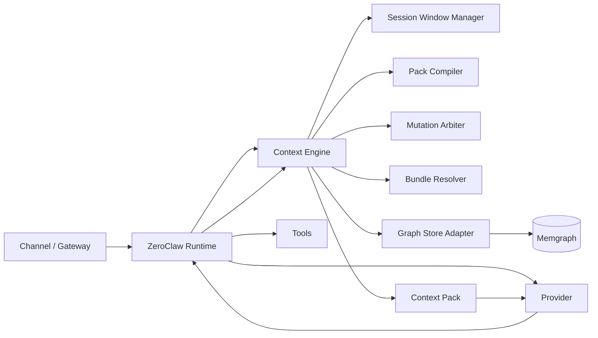

# Fiche contexte — Graph Context Engine intégré à un fork de ZeroClaw

## 1. Objet du document

Cette fiche formalise l’hypothèse d’un **Graph Context Engine** intégré à un **fork de ZeroClaw**, avec une architecture **graph-native**, **plug and play**, **packable**, et pensée pour une implémentation Rust propre.

L’objectif n’est pas d’ajouter une simple mémoire graphe ou une couche RAG à ZeroClaw. L’objectif est d’introduire un **véritable moteur de résolution de contexte** capable de :

* gouverner la composition du prompt système de manière dynamique ;
* piloter la session window d’un agent ;
* gérer des ensembles de graphe installables, exportables et combinables ;
* rendre les agents portables entre instances de graphe ;
* définir un protocole stable de packaging des agents, des skills et des bundles de connaissance ;
* conserver une architecture Rust modulaire, testable, et adaptée à un runtime agentique performant.

Ce document sert de **référence de cadrage technique** pour orienter la conception du fork.

---

## 2. Position d’architecture

## 2.1 Ce que ce moteur n’est pas

Le Graph Context Engine ne doit pas être conçu comme :

* un simple backend `Memory` branché derrière l’agent ;
* une variante plus sophistiquée du recall ;
* un système dépendant d’une chain of thought implicite ou non maîtrisable ;
* une logique de prompt engineering dispersée dans plusieurs endroits du runtime.

## 2.2 Ce que ce moteur doit devenir

Le Graph Context Engine doit devenir une **brique de runtime de premier rang**, placée entre :

* le runtime agentique ZeroClaw ;
* le stockage graph-native ;
* les packages d’agents, de skills et de bundles ;
* les règles de résolution du contexte ;
* les mécanismes de compaction, de mutation et de packing.

En pratique, le fork doit conserver ZeroClaw comme **runtime agentique**, mais remplacer son modèle de contexte par un système orienté :

* **Session Window gouvernée** ;
* **Context Pack compilé** ;
* **Native Nodes** ;
* **Packaging / Import / Export / Binding** ;
* **résolution de contexte par politiques**.

---

## 3. Diagnostic sur ZeroClaw

## 3.1 Ce qu’il faut conserver

ZeroClaw fournit déjà plusieurs bases très solides :

* runtime Rust léger et portable ;
* architecture largement orientée traits ;
* séparation claire des responsabilités entre providers, channels, tools et memory ;
* boucle agentique déjà fonctionnelle ;
* intégration outillée simple à étendre.

Ce socle est pertinent pour bâtir un fork plus ambitieux.

## 3.2 Ce qui bloque un moteur graph-native

Trois limites structurelles empêchent ZeroClaw, en l’état, de devenir un vrai moteur de contexte :

### A. Le prompt système est figé trop tôt

Le système actuel assemble une chaîne globale en amont puis la réutilise. Cela empêche :

* la recomposition du contexte à chaque tour ;
* la sélection dynamique d’ensembles de règles ;
* l’injection fine de vues, bundles, capabilities et contraintes ;
* la mise en place d’un moteur de résolution piloté par le graphe.

### B. L’historique conversationnel est plat

Un `Vec<ChatMessage>` n’exprime ni :

* la causalité ;
* la structure des dépendances ;
* le rattachement à des nœuds de preuve ;
* les vues actives ;
* les opérations de compaction contrôlée ;
* les liens entre message, bundle, skill, tool result et contexte calculé.

### C. Le rappel mémoire est trop limité

Un simple recall d’entrées classées ne suffit pas à représenter un contexte agentique. Il faut pouvoir :

* sélectionner un sous-graphe ;
* appliquer des politiques de visibilité ;
* recompiler la fenêtre active ;
* recalculer après chaque mutation significative.

Conclusion : un simple remplacement du backend mémoire ne suffira pas. Il faut insérer un **Context Engine** explicite dans la boucle du runtime.

---

## 4. Principe directeur

Le système doit reposer sur une séparation nette entre :

* **runtime agentique** ;
* **moteur de contexte** ;
* **stockage graphe** ;
* **packages portables**.

Le LLM ne doit pas manipuler directement la composition brute du prompt. Il doit travailler avec des **artefacts structurés**, inspectables et gouvernés.

Le moteur doit être capable de :

1. résoudre le contexte actif d’un tour ;
2. assembler un `ContextPack` ;
3. alimenter une `SessionWindow` ;
4. arbitrer les mutations de contexte ;
5. gérer l’installation et l’export de bundles ;
6. relier agents, skills et graph bundles dans un modèle portable.

---

## 5. Découpage architectural cible

## 5.1 Vue d’ensemble



## 5.2 Répartition des responsabilités

### Runtime ZeroClaw fork

Responsable de :

* gestion des channels ;
* orchestration provider/tool loop ;
* exécution des tools ;
* streaming / delivery ;
* supervision du tour ;
* émission des événements de runtime.

### Context Engine

Responsable de :

* résolution du contexte ;
* compilation des `ContextPack` ;
* sélection des vues et contraintes ;
* gestion de la `SessionWindow` ;
* arbitrage des mutations ;
* import / export des packages ;
* politiques de packing et de visibilité.

### Graph Store Adapter

Responsable de :

* lecture/écriture dans Memgraph ;
* recherche textuelle, topologique et vectorielle ;
* opérations de clôture, voisinage et sélection ;
* gestion transactionnelle des imports.

### Memgraph

Responsable de :

* persistance du graphe ;
* indexation ;
* exécution des requêtes ;
* support texte + vecteur + relations ;
* support de procédures spécialisées si nécessaire.

---

## 6. Native Nodes : le cœur du protocole

## 6.1 Pourquoi des nœuds natifs

Le moteur doit s’appuyer sur un noyau de nœuds compris nativement par le système.

Sans cela :

* un agent importé devient fragile ;
* les règles de résolution dépendent trop du schéma métier ;
* les bundles sont difficiles à partager ;
* la composition du prompt ne repose sur aucun protocole stable.

Les **nœuds natifs** sont donc les points d’ancrage obligatoires du moteur.

## 6.2 Définition

Un **nœud natif** est un nœud dont la sémantique est définie par le protocole du Context Engine lui-même, et non par un agent ou un domaine métier.

Ces nœuds servent à exprimer :

* les agents ;
* les bundles ;
* les skills ;
* les capacités ;
* les vues ;
* les politiques ;
* les sessions ;
* les packs ;
* les mutations ;
* les règles d’import/export.

## 6.3 Règle de conception

Le noyau natif doit rester **petit, stable et versionné**.

Il faut éviter de transformer toute la connaissance métier en ontologie native. Le moteur doit comprendre un protocole minimal, puis manipuler du payload autour de ce noyau.

---

## 7. Taxonomie native recommandée

## 7.1 Nœuds natifs de packaging / contrôle

* `AgentPackage`
* `AgentVersion`
* `GraphBundle`
* `BundleVersion`
* `SkillDefinition`
* `CapabilityDefinition`
* `Set`
* `BehaviorDefinition`
* `PolicyDefinition`
* `ImportStrategyDefinition`
* `SchemaContract`
* `EmbeddingSetDefinition`
* `ExportRuleSet`

## 7.2 Nœuds natifs de runtime

* `AgentInstance`
* `Binding`
* `Session`
* `SessionWindow`
* `ContextPack`
* `PackItem`
* `ResolutionTrace`
* `MutationProposal`
* `MutationDecision`
* `PackingDecision`
* `CompactionArtifact`

## 7.3 Nœuds payload / métier

* `Concept`
* `Entity`
* `Document`
* `Chunk`
* `Conversation`
* `Message`
* `Fact`
* `Evidence`
* `Template`
* `Tool`
* `Taxonomy`

## 7.4 Règle clé

Les nœuds payload sont libres et extensibles.

Les nœuds natifs, eux, doivent être interprétés par le moteur selon des règles explicites.

---

## 8. Relations natives minimales

Le protocole doit également définir un petit ensemble de relations natives.

Exemples :

* `DEPENDS_ON`
* `EXPOSES`
* `USES_SET`
* `USES_POLICY`
* `USES_SKILL`
* `USES_CAPABILITY`
* `BINDS_TO`
* `SEEDS`
* `CONTAINS`
* `INCLUDES`
* `EXPORTS`
* `EXCLUDES`
* `PACKS_AS`
* `GENERATED_FROM`
* `VISIBLE_TO`
* `PRIVATE_TO`
* `ATTACHED_TO_SESSION`
* `ACTIVE_IN_WINDOW`
* `JUSTIFIED_BY`
* `SUMMARIZES`
* `REPLACES`

Ce jeu doit rester limité afin de conserver un modèle portable.

---

## 9. Session Window comme objet de premier rang

## 9.1 Pourquoi

La fenêtre de session ne doit plus être un sous-produit implicite de l’historique texte. Elle doit devenir une structure gouvernée.

## 9.2 Ce qu’elle contient

Une `SessionWindow` doit contenir :

* les nœuds actuellement visibles ;
* les items résumés ;
* les décisions encore actives ;
* les contraintes de contexte ;
* les vues actives ;
* les références vers les preuves et artefacts ;
* les marqueurs de compaction/remplacement.

## 9.3 Ce qu’elle permet

* suivre précisément ce qui est présent dans le contexte ;
* ajouter ou retirer des nœuds sans modifier directement le prompt ;
* faire des mutations explicites et auditables ;
* recompiler un `ContextPack` déterministe.

---

## 10. Context Pack

## 10.1 Définition

Le `ContextPack` est l’artefact compilé remis au runtime pour alimenter le tour LLM.

Il ne s’agit pas du graphe complet, mais d’une projection optimisée du contexte utile.

## 10.2 Sections recommandées

Un `ContextPack` peut être composé de sections ordonnées :

1. `HardPolicies`
2. `AgentContract`
3. `ActiveSetContract`
4. `PinnedFacts`
5. `TaskFrame`
6. `EvidenceSet`
7. `CondensedHistory`
8. `CapabilityTeasers`
9. `ToolExposureHints`
10. `RuntimeNotes`

## 10.3 Propriété essentielle

Le `ContextPack` doit être :

* déterministe à politique donnée ;
* compact ;
* traçable ;
* révisable ;
* remplaçable section par section.

---

## 11. Règles de composition du prompt système

## 11.1 Nouvelle logique

Le prompt système ne doit plus être un bloc monolithique assemblé au démarrage.

Il doit être composé en deux couches :

### Base statique

Stable à l’échelle du runtime :

* contrat agentique général ;
* sécurité ;
* conventions tool/provider/channel ;
* identité de base du runtime.

### Overlay dynamique

Reconstruit par le Context Engine à chaque tour ou sous-tour significatif :

* contrat agent actif ;
* vue active ;
* bundles sélectionnés ;
* faits/policies épinglés ;
* état utile de la session ;
* capacités exposées ;
* signaux de task frame.

## 11.2 Ordre de priorité

Ordre recommandé :

1. hard policies ;
2. restrictions de vue ;
3. contraintes agent ;
4. faits et décisions actives ;
5. preuves utiles ;
6. historique condensé ;
7. capacités proposées.

## 11.3 Capabilities teaser

Le moteur ne doit pas toujours injecter toutes les capacités avec leurs schémas complets.

Il doit pouvoir :

* teaser une capability ;
* n’étendre son détail que si le contexte l’exige ;
* limiter le bruit et le coût de prompt.

---

## 12. Packaging : objectif et principes

## 12.1 But

Le système doit permettre de :

* packager un agent ;
* packager un bundle de graphe ;
* packager un ensemble skill + knowledge ;
* partager ces packages ;
* installer ces packages dans d’autres graphes ;
* choisir la stratégie d’import.

## 12.2 Contrainte clé

Un package ne doit pas dépendre d’un état runtime opaque. Il doit exprimer explicitement :

* ce qu’il contient ;
* ce qu’il requiert ;
* ce qu’il expose ;
* ce qui reste privé ;
* comment il doit être importé.

---

## 13. Types de packages

## 13.1 Agent Package

Contient :

* identité d’agent ;
* version ;
* vues ;
* politiques ;
* capabilities ;
* skills ;
* contrats de mutation ;
* stratégies par défaut.

## 13.2 Graph Bundle

Contient :

* ensemble de nœuds choisis ;
* relations ;
* règles d’export ;
* métadonnées de visibilité ;
* éventuels artefacts liés.

## 13.3 Skill Bundle

Contient :

* skill definitions ;
* templates ;
* dépendances natives minimales ;
* éventuellement vues ou policies associées.

## 13.4 Hybrid Bundle

Contient :

* skills ;
* sous-graphes ;
* embeddings ;
* documents ;
* règles de rebind / rehydration.

---

## 14. Manifeste de package

Chaque package doit porter un manifeste versionné.

Champs minimaux recommandés :

* `package_id`
* `kind`
* `version`
* `native_schema_version`
* `exports`
* `dependencies`
* `default_import_strategy`
* `visibility_rules`
* `packing_rules`
* `embedding_policy`
* `compatibility`
* `degradation_rules`
* `checksums`
* `signatures`

Exemple de structure logique :

```yaml
package_id: hf.agent.context-architect
kind: agent_package
version: 0.1.0
native_schema_version: 1
exports:
  - ref: agent/context-architect
  - ref: set/architecture-review
  - ref: policy/context-budget-default
dependencies:
  - package_id: core.native.protocol
    version: ^1
  - package_id: hf.bundle.architecture-patterns
    version: ^0.1
default_import_strategy: bind_or_map
visibility_rules:
  default: internal
  private_labels:
    - Secret
    - Credential
packing_rules:
  closure_mode: typed_closure
embedding_policy:
  mode: recompute_on_import
compatibility:
  requires_memgraph: true
  requires_features:
    - vector_search
    - text_search
degradation_rules:
  on_missing_dependency: degraded_mode
```

---

## 15. Visibilité, privacy et exportabilité

## 15.1 Exigence

Le moteur doit pouvoir distinguer précisément :

* ce qui est installable ;
* ce qui est exportable ;
* ce qui est visible au runtime ;
* ce qui est strictement privé.

## 15.2 Métadonnées recommandées

Au niveau nœud/relation, prévoir au minimum :

* `visibility = public | internal | private | local_only | exportable_with_consent`
* `packaging = include | exclude | derive_only | manifest_only`
* `sensitivity = normal | secret | regulated`
* `owner_scope`
* `tenant_scope`

## 15.3 Règle de sécurité

Le packaging ne doit jamais être un simple parcours de voisinage sans filtre. Il faut appliquer :

* filtre de clôture ;
* filtre de propagation ;
* contrôle de dépendances indirectes ;
* règles d’exclusion ;
* éventuellement redaction ou refus.

---

## 16. Stratégies de packaging

Le système doit supporter plusieurs stratégies.

## 16.1 Côté export

* `explicit_set`
* `dependency_closure`
* `k_hop_entourage`
* `typed_closure`
* `semantic_slice`
* `hybrid_closure`

## 16.2 Côté import

* `strict_reference`
* `bind_or_map`
* `seed_core`
* `clone_semantic_core`
* `full_bundle`
* `degraded_mode`

## 16.3 Règle importante

L’import doit être capable d’exprimer clairement :

* ce qui a été lié ;
* ce qui a été copié ;
* ce qui a été substitué ;
* ce qui manque ;
* ce qui empêche un fonctionnement complet.

---

## 17. Agents portables et plug and play

## 17.1 Exigence métier

Un agent doit pouvoir être déplacé d’un graphe à un autre avec un coût minimal.

## 17.2 Ce que cela implique

Un agent portable ne peut pas dépendre de références locales implicites. Il doit déclarer :

* ses dépendances natives ;
* ses vues ;
* ses skills ;
* ses capabilities ;
* ses stratégies de binding ;
* ses exigences minimales ;
* ses modes de dégradation.

## 17.3 Résolution à l’import

Lorsqu’un agent est installé dans un nouveau graphe, le moteur doit pouvoir :

1. vérifier les dépendances ;
2. trouver les nœuds compatibles ;
3. binder ou cloner selon stratégie ;
4. créer les nœuds runtime nécessaires ;
5. produire un rapport d’installation.

---

## 18. Skills et bundles mixtes

Un skill ne doit pas être limité à un simple fichier markdown.

Il doit pouvoir être relié à :

* des knowledge nodes ;
* des policies ;
* des vues ;
* des templates ;
* des documents ;
* des embeddings ;
* des contraintes d’exposition.

Cela permet de produire des ensembles réutilisables de type :

* skill + corpus ;
* skill + taxonomie ;
* skill + méthodes ;
* skill + sous-graphe de référence.

---

## 19. Embeddings comme artefacts packables

## 19.1 Principe

Les embeddings peuvent être packagés, mais ils ne doivent jamais être considérés comme des vérités métier stables.

Ils sont des artefacts dérivés.

## 19.2 Métadonnées minimales

Un `EmbeddingSetDefinition` doit porter :

* `encoder_id`
* `encoder_version`
* `dimensions`
* `distance_metric`
* `chunking_profile_id`
* `source_hash`
* `created_at`
* `rebuild_policy`
* `storage_mode`

## 19.3 Modes d’import

* `manifest_only`
* `recompute_on_import`
* `include_vectors`
* `include_vectors_if_same_encoder`

## 19.4 Bonne pratique

Le système doit pouvoir réhydrater ou recalculer les embeddings si l’environnement cible n’est pas compatible.

---

## 20. Place de Memgraph

## 20.1 Pourquoi Memgraph

Memgraph est pertinent comme moteur de stockage graph-native car il offre :

* un vrai moteur graphe ;
* des possibilités de recherche vectorielle ;
* de la recherche textuelle ;
* un écosystème Rust exploitable ;
* une bonne base pour un runtime temps réel.

## 20.2 Ce qu’il doit porter

Memgraph doit porter :

* les nœuds/relations ;
* les index ;
* les recherches topologiques ;
* les recherches vecteur/texte ;
* les métadonnées de package ;
* les journaux de résolution et d’import.

## 20.3 Ce qu’il ne doit pas porter seul

La logique de résolution de contexte ne doit pas être entièrement poussée dans la base.

Le moteur applicatif Rust doit garder :

* l’arbitrage ;
* la compilation du `ContextPack` ;
* les politiques ;
* les décisions de packing ;
* la validation des mutations ;
* les contrats de dégradation.

---

## 21. Intégration dans le fork ZeroClaw

## 21.1 Point d’insertion principal

Le Context Engine doit être appelé **avant chaque appel LLM significatif**, et pas uniquement à la réception initiale d’un message.

Il faut permettre une résolution du contexte à chaque étape importante de la boucle agentique.

## 21.2 Cycle cible

1. réception d’un message ;
2. identification de la session/agent/view ;
3. récupération de l’état courant de la `SessionWindow` ;
4. sélection de nœuds et de bundles ;
5. compilation du `ContextPack` ;
6. composition du prompt de tour ;
7. appel provider ;
8. exécution éventuelle des tools ;
9. ingestion des résultats dans le graphe ;
10. mutation éventuelle de la `SessionWindow` ;
11. recompilation si nécessaire.

## 21.3 Conséquence

Le contexte doit être traité comme un **state machine runtime**, pas comme une concaténation de texte.

---

## 22. Mutations de contexte

## 22.1 Pourquoi les formaliser

L’agent doit pouvoir faire évoluer sa fenêtre de session et ses dépendances actives, mais cela doit être explicite, gouverné et traçable.

## 22.2 Exemples de mutations

* épingler un concept ;
* retirer un nœud devenu inutile ;
* remplacer une sous-partie par une synthèse ;
* activer une vue ;
* charger un bundle supplémentaire ;
* compacter des messages en artefact résumé ;
* rattacher une nouvelle preuve.

## 22.3 Forme attendue

Le LLM ne doit pas directement manipuler le prompt. Il doit produire au mieux :

* `ContextMutationProposal`
* `PackingDecision`
* `SelectionRationale`
* `SummaryReplacementPlan`

Le moteur décide ensuite quoi appliquer.

---

## 23. Interfaces Rust recommandées

## 23.1 Philosophie

L’architecture doit rester idiomatique Rust :

* traits pour les ports ;
* structs pour l’état ;
* enums pour les stratégies ;
* composition explicite ;
* testabilité sans dépendre d’un provider LLM réel.

## 23.2 Traits clés

```rust
pub trait ContextEngine: Send + Sync {
    async fn assemble_turn(&self, req: AssembleTurnRequest) -> anyhow::Result<ResolvedContext>;
    async fn apply_mutation(&self, req: ApplyMutationRequest) -> anyhow::Result<MutationOutcome>;
    async fn ingest_turn_event(&self, event: TurnEvent) -> anyhow::Result<()>;
    async fn import_package(&self, req: ImportPackageRequest) -> anyhow::Result<ImportReport>;
    async fn export_bundle(&self, req: ExportBundleRequest) -> anyhow::Result<BundleArtifact>;
}
```

```rust
pub trait GraphStore: Send + Sync {
    async fn read_set(&self, query: GraphReadQuery) -> anyhow::Result<GraphReadResult>;
    async fn text_search(&self, req: TextSearchRequest) -> anyhow::Result<Vec<NodeHit>>;
    async fn vector_search(&self, req: VectorSearchRequest) -> anyhow::Result<Vec<NodeHit>>;
    async fn write_control(&self, cmd: GraphControlWrite) -> anyhow::Result<()>;
    async fn begin_import(&self, req: ImportPlan) -> anyhow::Result<ImportHandle>;
}
```

```rust
pub trait SessionWindowManager: Send + Sync {
    async fn snapshot(&self, session_id: &str) -> anyhow::Result<SessionWindowSnapshot>;
    async fn propose(&self, proposal: ContextMutationProposal) -> anyhow::Result<ValidationReport>;
    async fn apply(&self, proposal: ApprovedMutation) -> anyhow::Result<SessionWindowSnapshot>;
}
```

```rust
pub trait PackCompiler: Send + Sync {
    async fn compile(&self, input: PackCompileInput) -> anyhow::Result<ContextPack>;
}
```

## 23.3 Objets de domaine recommandés

* `ResolvedContext`
* `ContextPack`
* `ContextPackSection`
* `SessionWindowSnapshot`
* `NativeRef`
* `GraphRef`
* `ContextMutationProposal`
* `ImportPlan`
* `ImportReport`
* `BundleArtifact`
* `ResolutionTraceRecord`

---

## 24. Séparation des couches logiques

## 24.1 Control plane

Responsable de :

* agents ;
* bundles ;
* skills ;
* policies ;
* manifests ;
* règles d’import/export ;
* visibilité.

## 24.2 Runtime plane

Responsable de :

* sessions ;
* session windows ;
* context packs ;
* traces de résolution ;
* compaction ;
* mutations.

## 24.3 Knowledge plane

Responsable de :

* concepts ;
* documents ;
* chunks ;
* faits ;
* preuves ;
* embeddings ;
* taxonomies.

Cette séparation est importante pour éviter qu’un bundle métier ne soit confondu avec un objet de protocole.

---

## 25. Compaction et préservation de topologie

## 25.1 Limite du résumé texte seul

Une compaction qui remplace des tours par un simple bloc de texte perd :

* la structure des dépendances ;
* les liens de preuve ;
* les décisions encore actives ;
* la capacité de re-référencer proprement les éléments.

## 25.2 Direction cible

La compaction doit pouvoir produire un `CompactionArtifact` relié au graphe et référencé dans la `SessionWindow`.

Cela permet :

* de remplacer sans détruire ;
* de garder une traçabilité ;
* de reconstruire plus tard une vue plus riche si nécessaire.

---

## 26. Politique de résolution

Le moteur doit être piloté par des politiques explicites.

Exemples :

* budget de taille du `ContextPack` ;
* score minimal de pertinence ;
* poids par type de nœud ;
* poids par vue active ;
* priorité aux décisions épinglées ;
* déduplication ;
* restrictions de visibilité ;
* exposition conditionnelle des capabilities ;
* mode de compaction.

Une `PolicyDefinition` native doit pouvoir être activée par agent, par session, ou par bundle.

---

## 27. Contraintes d’implémentation Rust

## 27.1 Ce qu’il faut viser

* APIs async propres ;
* typage fort sur les objets de domaine ;
* isolation des adapters ;
* sérialisation stable des manifests ;
* tests unitaires sans base réelle ;
* tests d’intégration avec Memgraph.

## 27.2 Ce qu’il faut éviter

* logique de résolution disséminée ;
* prompts reconstruits de manière opportuniste dans plusieurs modules ;
* dépendance à un backend mémoire plat pour des objets runtime ;
* couplage fort entre agent package et schéma métier local.

---

## 28. Risques principaux

## 28.1 Sur-abstraction

Risque : vouloir rendre tout natif, tout packable, tout versionné.

Conséquence : moteur trop lourd, trop abstrait, difficile à maintenir.

Réponse : conserver un noyau natif petit et stable.

## 28.2 Ontologie native trop large

Risque : le protocole devient dépendant des domaines métier.

Réponse : limiter la sémantique native au contrôle/runtime/packaging.

## 28.3 Packaging dangereux

Risque : exporter par proximité des nœuds privés ou sensibles.

Réponse : politique stricte de visibilité et de propagation.

## 28.4 Confiance excessive dans les embeddings

Risque : transporter des artefacts incompatibles ou périmés.

Réponse : toujours décrire les embeddings comme dérivés, versionnés et recalculables.

---

## 29. MVP recommandé

## Phase 1 — noyau runtime

* introduire `ContextEngine` ;
* introduire `SessionWindow` ;
* introduire `ContextPack` ;
* brancher l’assemblage avant chaque appel LLM significatif ;
* créer `ResolutionTrace`.

## Phase 2 — protocole minimal

* schéma des nœuds natifs ;
* manifeste `agent.yaml` ;
* manifeste `bundle.yaml` ;
* stratégies d’import/export minimales.

## Phase 3 — Memgraph adapter

* adapter `GraphStore` ;
* requêtes text search / vector search / graph traversal ;
* métadonnées de visibility / packaging ;
* premiers imports transactionnels.

## Phase 4 — mutations et compaction

* `ContextMutationProposal` ;
* validation ;
* application ;
* `CompactionArtifact` ;
* remplacement gouverné.

## Phase 5 — knowledge library

* installation de bundles ;
* dépendances partageables ;
* skill bundles ;
* bundles mixtes skill + graph + embeddings.

---

## 30. Conclusion

La bonne lecture stratégique est la suivante :

* **ZeroClaw reste le runtime agentique** ;
* **le Graph Context Engine devient le runtime de contexte** ;
* **Memgraph devient le substrate graph-native** ;
* **le protocole central repose sur des nœuds natifs stables** ;
* **la session window et le context pack deviennent des objets de premier rang** ;
* **agents, skills et bundles deviennent portables, installables et combinables**.

Le point clé n’est donc pas simplement “mettre un graphe dans ZeroClaw”.

Le vrai enjeu est de définir un **protocole de résolution, de packaging et de gouvernance du contexte**, suffisamment fort pour permettre :

* la portabilité ;
* la modularité ;
* la traçabilité ;
* la compaction ;
* la réutilisation ;
* et, à terme, une vraie **knowledge library installable**.

---

## 31. Prochaine suite logique

Les trois artefacts à produire ensuite sont :

1. le **schéma précis des nœuds natifs et relations natives** ;
2. le **format détaillé des manifests `agent.yaml` et `bundle.yaml`** ;
3. le **squelette Rust du Context Engine et de ses ports principaux**.
