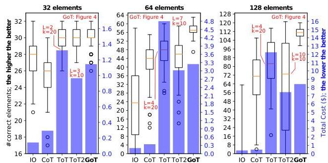
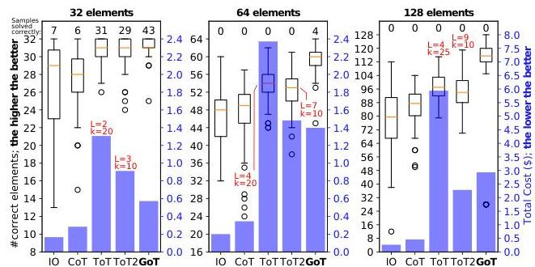

# A Positive Score Evaluation

The following figures plot the same data as Figures 5 and 6 respectively, however use the "positive score" described in Sections 5.1 and 5.2.

Figure 9: Accuracy and cost in sorting tasks with ChatGPT-3.5.  $L$  and  $k$  indicate the structure of ToT (see Sections 3.2 and 6).

Figure 10: Accuracy and cost in set intersection with ChatGPT-3.5.  $L$  and  $k$  indicate the structure of ToT (see Sections 3.2 and 6).

# B Example Prompts - Sorting

We present the prompts only for the sorting of 32-element lists, as those for 64-element and 128-element lists are identical, except for the split_prompt where the number of elements in the one-shot example matches the problem size.

For sorting, we employ three distinct types of operations that interact with the LLM, each with its corresponding prompts. First, there is the Generate operation, utilizing the sort_prompt to guide the LLM in sorting a provided list of values, and the split_prompt to direct the LLM to split a specified list into a designated number of sublists. Next, the Improve operation employs the improve_prompt to instruct the LLM to refine a sorted list if it detects mistakes. Finally, the Aggregate operation leverages the merge_prompt to guide the LLM in merging two pre-sorted lists into a single sorted list.

First, we present the prompt stubs (Table 3), serving as templates to dynamically generate appropriate prompts at runtime. For clarity, we display their corresponding few-shot examples separately in Table 4. Following this, we outline

the LLM interactions throughout the process of solving the sorting use case (Table 5 - Table 9).