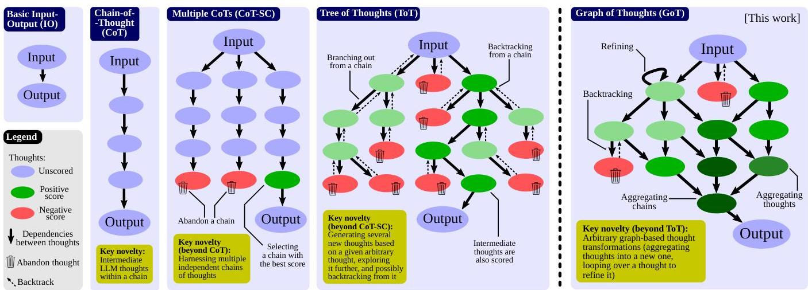
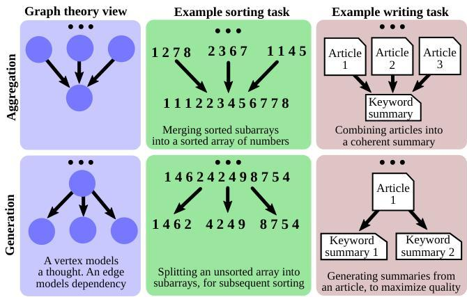

Figure 1: Comparison of Graph of Thoughts (GoT) to other prompting strategies.

Formally, GoT can be modeled as a tuple  $(G,\mathcal{T},\mathcal{E},\mathcal{R})$  where  $G$  is the "LLM reasoning process" (i.e., all the LLM thoughts within the context, with their relationships),  $\mathcal{T}$  are the potential thought transformations,  $\mathcal{E}$  is an evaluator function used to obtain scores of thoughts, and  $\mathcal{R}$  is a ranking function used to select most relevant thoughts.

# 3.1 Reasoning Process

We model the reasoning process as a directed graph  $G = (V, E)$ ;  $V$  is a set of vertices and  $E \subseteq V \times V$  is a set of edges.  $G$  is directed and thus the edges are a subset of ordered vertex pairs  $E \subseteq V \times V$ . A vertex contains a solution to a problem at hand (be it an initial, intermediate, or a final one). The concrete form of such a thought depends on the use case; it could be a paragraph (in writing tasks) or a sequence of numbers (in sorting). A directed edge  $(t_1, t_2)$  indicates that thought  $t_2$  has been constructed using  $t_1$  as "direct input", i.e., by explicitly instructing the LLM to use  $t_1$  for generating  $t_2$ .

In certain use cases, graph nodes belong to different classes. For example, in writing tasks, some vertices model plans of writing a paragraph, while other vertices model the actual paragraphs of text. In such cases, GoT embraces a heterogeneous graph  $G = (V, E, c)$  to model the LLM reasoning, where  $c$  maps vertices  $V$  into their respective classes  $C$  (in the above case, it would be  $C = \{plan, par\}$ ). Hence, any vertex  $v$  can model different aspects of reasoning.

We associate  $G$  with the LLM reasoning process. To advance this process, one applies thought transformations to  $G$ . An example of such a transformation is to merge best-scoring (so far) thoughts into a new one. Another example is to loop over a thought, in order to enhance it. Note that these transformations strictly extend the set of transformations available in the CoT, CoT-SC, or ToT.

# 3.2 Transformations of Thoughts

GoT enables novel transformations of thoughts thanks to the graph-based model for reasoning. We refer to them as

Figure 2: Examples of aggregation and generation thought transformations.

graph-enabled transformations. For example, in writing, one could combine several input articles into one coherent summary. In sorting, one could merge several sorted subarrays of numbers into a final sorted array. We illustrate examples of aggregation and generation in Figure 2.

Formally, each such transformation can be modeled as  $\mathcal{T}(G,p_{\theta})$  where  $G = (V,E)$  is the graph reflecting the current state of the reasoning, and  $p_{\theta}$  is the used LLM.  $\mathcal{T}$  modifies  $G$  usually by adding new vertices and their incoming edges. We have  $G^{\prime} = \mathcal{T}(G,p_{\theta}) = (V^{\prime},E^{\prime})$ , where  $V^{\prime} = (V\cup V^{+})\setminus V^{-}$  and  $E^{\prime} = (E\cup E^{+})\setminus E^{-}$ .  $V^{+}$  and  $E^{+}$  are new vertices and edges inserted into  $G$  to model the new thoughts and their dependencies, respectively. To maximize the expressiveness of GoT - we also enable the user to explicitly remove thoughts, by specifying the corresponding vertices and edges to be removed ( $V^{-}$  and  $E^{-}$ , respectively). Here, it is the user's responsibility to ensure that the sets  $V^{+},E^{+},V^{-}$ , and  $E^{-}$  come with consistent transformations (i.e., for example, that the user does not attempt to remove a vertex that does not exist). This enables seam-