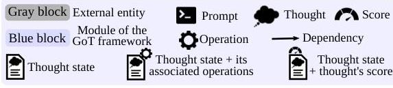
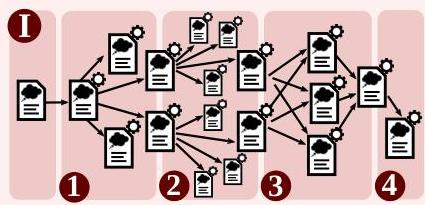
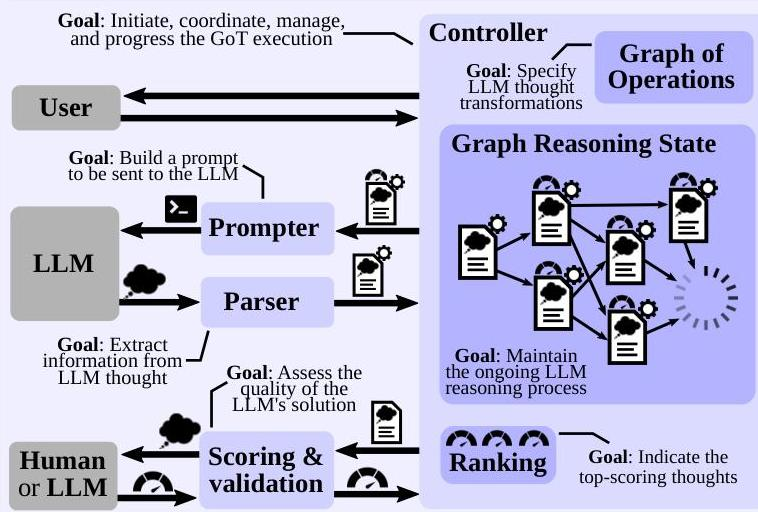
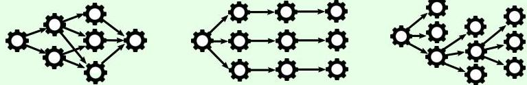

# Legend

# API for Controller

- //LLM params: model used, temperature, max tokens, api key, org, ...
- //LLM cost features: prompt token cost, response token cost, ...
- //Instances of Prompter  $\times$  Parser  $\times$  Graph of Operations,
- //Any additional input parameters (e.g., numbers to be sorted).

# Available operations when building the GoO (extensible)

- Generate, Aggregate, Score, ... //see Prompter API
- KeepBest(M) //preserves N best scoring thoughts
- Repeat(k) //Repeat a given operation k times, generating k thoughts.
- For example, this enables "Aggregate" to generate multiple outcomes
- of the combination operation. Each such thought is maintained
- within the Graph Reasoning State and scored individually.

# API for Prompter (extensible)

- Generate(t, k) //generate a prompt for k new thoughts, using thought t
- ValidateAndImprove(t) //generate a prompt to enhance thought t,
- Aggregate(t1, ..., tk) //generate a prompt to combine thoughts t1, ..., tk
- Score(t) //score thought t
- Validate(t) //generate a prompt to validate the correctness of thought t

# API for Parser (extensible)

ParseGenerate, ParseImprove, ParseScore, ParseAggregate, ParseValidate, ...

//Each of the above routines is responsible for parsing an LLM thought /to a corresponding Prompter routine (e.g., ParseScore parses Score).

# Example prompts and the Graph Reasoning State for the sorting use case

# (some examples within each prompt are omitted due to space constraints)

# Initial/system prompt

# (optional)

Hello, I want to sort the following input sequence of numbers: (input)

Figure 3: The system architecture of GoT, and the APIs of respective modules. The user can straightforwardly extend the design towards new prompting schemes, experiment with novel thought transformations, and plug in different LLMs. The blue part of the figure contains the architecture overview, the green part lists the API, and the red part contains example prompts together with a GRS and operations involved.

# A prompt used by Generate(t, k=1) + Repeat(k=4)

# (Instruction)

# Specifying the Structure of the Graph of Operations (GoO)

Graph of Operations enables seamless specification of not only GoT, but also existing schemes such as CoT, CoT-SC, ToT

# Example prompts and by Generate(t, k=4)

# (some examples within each prompt are omitted due to space constraints)

- Instruction&gt; Sort the following list of numbers in ascending order: Output only the sorted list of numbers, no additional text. <instruction>
<example> Input: [3,7,0,2,8,1,2,2,2,4,7,8,5,5,3,9,4,3,5,6,6,4,4,5, 2,0,9,3,3,9,2,1] Output: [0,0,1,1,2,2,2,2,2,2,3,3,3,3,4,4,4,4,5,5,5,5, 6,6,7,7,8,8,9,9,9] <example> The input: (input) </example>
This prompt is used by an operation Generate where the branching factor is  $k / 3$ , which means, only one thought is obtained. However, the prompt is not an operation. The result is that it is used to the operation Generate is  $k / 4$ . The difference between these two is that Generate(1, k/4) gives the user more control over how these multiple thoughts are constructed, while Generate(1, k/3) + Repeat(k/4) is less flexible but more easy to use. Moreover, with Repeat size has 4 content isolated responses from the LLM for identical prompts, whereas without Repeat there is only one context where all 4 thoughts are generated and must be explicitly handled in a single prompt/amount.

# A prompt used by

Aggregate(t1,12)+Repeat(k=3)+KeepBest(N=1)

&gt; Instruction&gt; Merge the following 2 sorted lists of length (length1) each into one sorted list of length (length2) using a merge sort style approach. Only output the final merged list without any additional text or thoughts!

# <instruction>

<approach>

To merge the two lists in a merge-sort style approach, follow these steps:

1. Compare the first element of both lists.
2. Append the smaller element to the merged list and move to the next element in the list from which the smaller element came.
3. Repeat steps 1 and 2 until one of the lists is empty.
4. Append the remaining elements of the non-empty list to the merged list.

# <approach>

Merge the following two lists into one sorted list:

1: (Input) 2: (Input) The input thoughts (t, s)  $\rightarrow$  3

Merged list:

This prompt is used by an operation Aggregate where the aggregation factor is  $k = 1 / 2$  input through the word "merging" (This is repeated by GoT 3 items in maximum quality. Finally, the text is part is selected. Your text, in this example, the prompt explicitly imparts the merge operation only. All the remaining options must be specified in the GoO and are handled by the underlying GoT framework.

# A prompt used by Improve(t) + Repeat(k=4)

# 1. Instruction&gt; The following two lists represent an unsorted list of numbers and a sorted variant of that list. The sorted variant is not correct. Fix the sorted variant so that it is correct. Make sure that the output list is sorted in ascending order, has the same number of elements as the input list (thought), and contains the same elements as the input list. <instruction>

# <approach>

To fix the incorrectly sorted list follow these steps:

1. For each number from 0 to 9, compare the frequency of that number in the incorrectly sorted list to the frequency of that number in the input list.
2. Iterate through the incorrectly sorted list and add or remove numbers as needed to make the frequency of each number in the incorrectly sorted list match the frequency of that number in the input list.

# <approach>

<example>

Input: [3,7,0,2,8,1,2,2,2,4,7,8,5,5,3,9]

Incorrectly Sorted: [0,0,0,0,0,1,2,2,3,3,4,4,4,5,5,7,7,8,8,9,9,9,9]

Reason: The incorrectly sorted list contains four extra  $0s$ , two extra  $4s$  and three extra  $9s$  and is missing two  $2s$ .

Output: [0, 1, 2, 2, 2, 2, 3, 3, 4, 5, 5, 7, 7, 8, 8, 9]

Input: [6, 4, 5, 7, 5, 6, 9, 7, 6, 9, 4, 6, 9, 8, 1, 9, 2, 4, 9, 0, 7, 6, 5, 6, 6, 2, 8, 3, 9, 5, 6, 1]

Incorrectly Sorted: [0, 1, 1, 2, 2, 3, 4, 4, 4, 4, 4, 5, 5, 5, 5, 6, 6, 6, 6, 6, 6, 7, 7, 7, 8, 8, 9, 9, 9, 9, 9]

Reason: The incorrectly sorted list contains two extra 4s and is missing two 6s and one 9.

Output: [0, 1, 1, 2, 2, 3, 4, 4, 4, 5, 5, 5, 5, 6, 6, 6, 6, 6, 6, 6, 6, 7, 7, 7, 8, 8, 9, 9, 9, 9, 9]

<example> The input: (the="" 1.="" 2.="" 3.="" 4.="" 5.="" 5,="" 6.="" 6.="" 7.="" 7.="" 8.="" 8.9,="" <="" [instructly="" a="" and="" between="" by="" can="" change.="" contain="" contain="" contains="" data="" design="" do="" each="" example="" example)="" example) </example></example></instruction></approach></liststruction></approach></instruction></listruction>