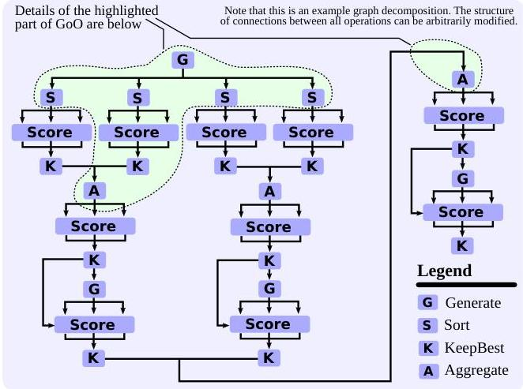
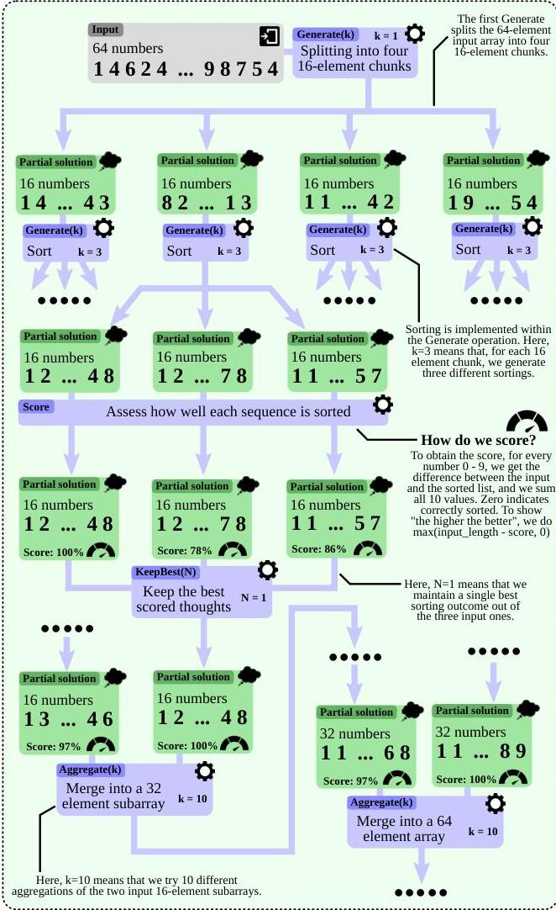

# 5 Example Use Cases

We now describe several use cases of GoT. We detail one use case (sorting) and summarize the others.

# 5.1 Sorting

We focus on the decomposition of the sorting use case and Graph of Operations, which are central for implementing and executing any workload within GoT.

We consider sorting numbers 0-9 with duplicates. The considered LLMs are unable to sort a sequence of such numbers correctly beyond a certain length consistently because duplicate counts do not match.

In GoT, we employ merge-based sorting: First, one decomposes the input sequence of numbers into subarrays. Then, one sorts these subarrays individually, and then respectively merges them into a final solution. Figure 4 illustrates this use case together with its graph decomposition. Here, an LLM thought is a sequence of sorted numbers.

To score an outcome, denote an input sequence with  $[a_1, a_2, \dots, a_n]$  and an output one with  $[b_1, b_2, \dots, b_m]$ . We use the following score that determines "the scope" of errors:

error-scope  $= X + Y$

where  $p\in \{1,\dots,m\}$ $q\in \{1,\dots,n\}$  , and

$$
X = \sum_ {i = 1} ^ {m - 1} \operatorname {s g n} \left(\max  \left(b _ {i} - b _ {i + 1}, 0\right)\right),
$$

$$
Y = \sum_ {i = 0} ^ {9} | | \{b _ {p}: b _ {p} = i \} | - | \{a _ {q}: a _ {q} = i \} | |
$$

Here,  $X$  indicates how many consecutive pairs of numbers are incorrectly sorted. If two numbers  $i$  and  $i + 1$  are incorrectly sorted (i.e.,  $b_{i} &gt; b_{i + 1}$ ), then the expression within the summation returns 1, increasing the error score by one. For two numbers correctly sorted, this expression amounts to 0. Then,  $Y$  determines how well a given output sequence preserves the frequency of output numbers. Specifically, for each considered number  $x$  ( $x \in \{0, \dots, 9\}$ ), we obtain the difference between the count of input elements being equal to  $x$ , vs. the count of output elements equal to  $x$ . For an output sequence perfectly preserving the frequency of  $x$ , this would amount to 0. Any single "deviation" in this count, increases the "error scope" by 1. We then sum this over all considered values of  $x$ . When plotting this score, to improve the clarity of plots, we additionally apply clipping min(error-scope,  $n$ ), as some baselines (IO, CoT) result in large numbers of outliers with high error scope. Finally, to use a "positive score" describing "the scope of correctly sorted" elements, one can use the value  $\max(n - \text{error-scope}, 0)$ .

# 5.2 Set Operations

Moreover, we also consider set operations, focusing on set intersection. They have numerous applications (particularly set intersection) in problems ranging from genome or document comparisons to pattern matching [9-11, 20, 27, 38, 50,

Graph of Operations (GoO) for sorting 64 numbers

Details of the highlighted part of the GoO from above
Figure 4: An example graph decomposition of the sorting use case in GoT. All used operations (Generate, Aggregate, Score, KeepBest) are described in Figure 3.