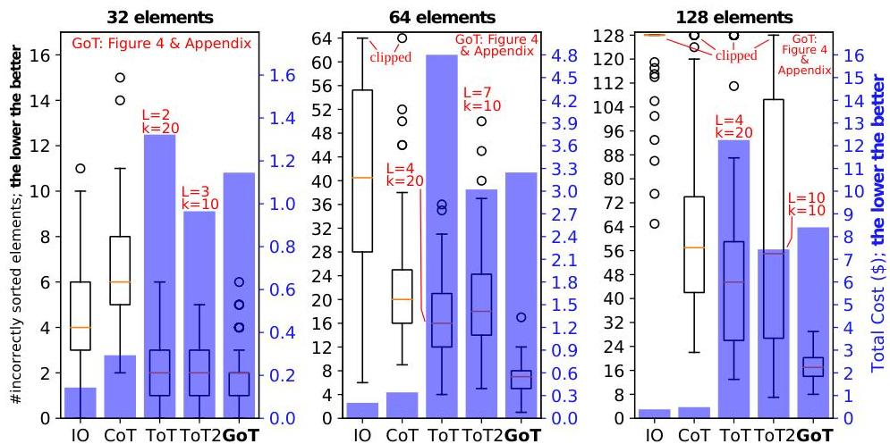

Figure 5: Number of errors and cost in sorting tasks with ChatGPT-3.5.  $L$  and  $k$  indicate the structure of ToT (see Sections 3.2 and 6).

Used LLMs Due to budget restrictions, we focus on GPT-3.5. We also experimented with Llama-2, but it was usually worse than GPT-3.5 and also much slower to run, making it infeasible to obtain enough samples.

# 7.2 Analysis of GoT's Advantages

The results of the analysis are in Figure 5 (sorting), 6 (set intersection), 7 (keyword counting), and 8 (document merging); see Section 5 for the description of specific use cases. Overall, GoT improves the quality of outcomes over all the considered baselines and it reduces inference costs compared to ToT.

GoT vs. ToT GoT improves upon ToT and ToT2 by a large margin over all the considered problem instances. ToT usually comes with somewhat higher quality than ToT2, but simultaneously much higher costs. GoT's costs are always lower than ToT, and comparable (in some cases lower, in others higher) to ToT2. For example, it reduces median error by  $\approx 62\%$ , thereby achieving a higher quality of sorting, for  $P = 128$  in comparison to ToT while ensuring  $&gt;31\%$  cost reductions. These advantages are due to GoT's ability to decompose complex tasks into simpler subtasks, solve these subtasks independently, and then incrementally merge these outcomes into the final result.

GoT vs. IO and CoT GoT consistently delivers much higher quality of outcomes than IO/CoT. For example, for sorting  $(P = 64)$ , GoT's median error is  $\approx 65\%$  and  $\approx 83\%$  lower than, respectively, CoT and IO. Yet, the costs of GoT - and ToT - are much higher than in IO and CoT. This is mostly due to our configuration of CoT, where we do not artificially inflate the lengths of the chains of reasoning if this does not improve the outcomes. The higher costs of GoT and ToT are driven by  $k$  new thoughts built for each Generate operation; these multiple thoughts are one of the reasons for GoT's superiority in quality.

Increasing Complexity of Tackled Problems Most importantly, the advantages of GoT in the quality increase for all the baselines with the growing size of the problem  $P$ . For

example, in sorting, while for  $P = 32$  GoT only negligibly improves upon ToT2, its median error count becomes lower by  $\approx 61\%$  for  $P = 64$  and  $\approx 69\%$  for  $P = 128$ . The quartiles also become respectively better. The results for other schemes also follow the intuition; for example, IO becomes consistently worse with the increasing  $P$ , which is expected as a single thought is unlikely to solve a large problem instance. Overall, this analysis illustrates that GoT is indeed well-suited for elaborate problem cases, as the execution schedules usually become more complex with the growing problem sizes.

# 7.3 Discussion on Task Decomposition

When splitting a task into subtasks and then solving these subtasks, the size of responses and the input (in tokens) are reduced proportionally to the degree of the task decomposition. However, the "static" part of the prompt (i.e., few-shot examples) may become a significant overhead (see GoT4 to GoT8 in Figure 7). Here, we observe that these few-shot examples can usually also be reduced in size (e.g., the passages used to demonstrate keyword counting can also be made smaller and still be indicative of the actual input size), thus actively working towards decreasing the cost (e.g., see the difference between GoT8 and GoTx in Figure 7).

The overall goal when conducting graph decomposition is to break down a task to the point, where the LLM can solve it correctly for the majority of time using a single prompt (or with a few additional improvement steps). This significantly lowers the number of improvement/refinement steps needed during the later stages of the graph exploration. Furthermore, as indicated by our results, combining or concatenating subresults is usually an easier task than solving large task instances from scratch. Hence, the LLM is often successful when aggregating the final solution.

# 8 Related Work

We summarize relations between GoT and related work.