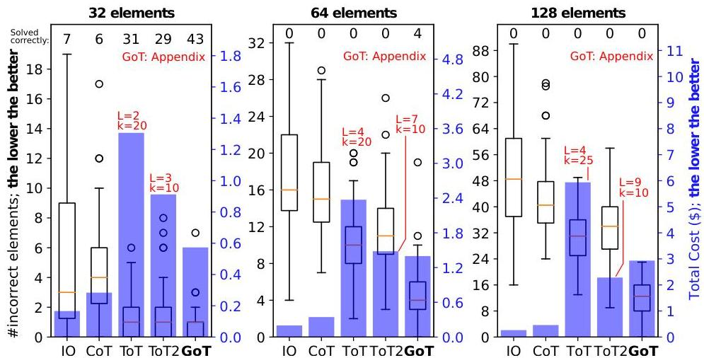
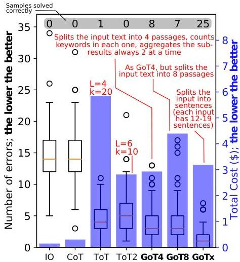
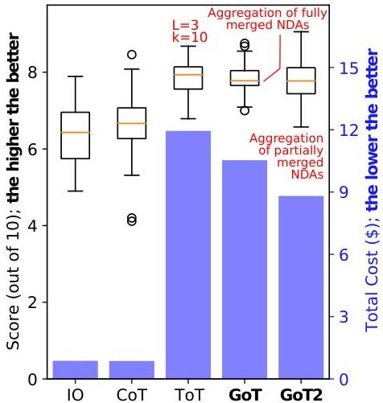

Figure 6: Number of errors and cost in set intersection tasks with ChatGPT-3.5.  $L$  and  $k$  indicate the structure of ToT (see Sections 3.2 and 6).

Figure 7: Number of errors and cost in keyword counting with ChatGPT-3.5.  $L$  and  $k$  indicate the structure of ToT (see Sections 3.2 and 6).

# 8.1 Prompting Paradigms &amp; Approaches

We detail different prompting paradigms in Section 1 and Table 1. There are numerous other works related to prompting. We now briefly summarize selected most related ones; more extensive descriptions can be found in dedicated surveys [34, 40, 69, 70]. Wang et al. proposed Plan-and-Solve, an approach to enhance CoT with an explicit planning stage [66]. Using complexity-based criteria to enhance prompting within a CoT was designed by Fu et al. [29, 67]. The self-taught reasoner (STaR) [80] generates several chain of thoughts, and selects the ones that are valid. Similarly, a scheme by Shum et al. [61] generates a pool of CoT candidates, and selects the best candidate based on whether the candidates match the ground truth and on a policy gradient-based method. Automatic prompt generation overcomes the

Figure 8: Score and cost in document merging with ChatGPT-3.5.  $L$  and  $k$  indicate the structure of ToT (see Sections 3.2 and 6). Number of samples: 50; context size: 16k tokens.

issues of scaling in CoT [41, 42, 59]. Zhou et al. propose to harness selecting the best prompt out of a candidate set [84]. Skeleon-of-Thought [47] generates at first a number of skeleton answers (brief bullet points of 3 to 5 words) and expands on these points in parallel in a second step.

Finally, in prompt chaining, one cascades different LLMs. This enables prompting different LLMs via different contexts, enabling more powerful reasoning [21, 23, 48, 51, 72, 73, 73]. GoT is orthogonal to this class of schemes, as it focuses on a single context capabilities.

# 8.2 Self-Reflection &amp; Self-Evaluation

Self-reflection and self-evaluation were introduced recently [45, 49, 60, 75, 85]. They are used to enhance different tasks, for example for code generation [17] or com