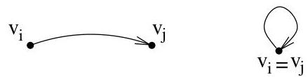
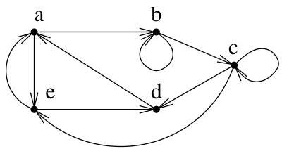

Chapitre I. Premier contact avec les graphes

arcs adjacents

sont représentés par des points et si  $(v_{i}, v_{j})$  est un arc, alors on trace une flèche de  $v_{i}$  vers  $v_{j}$  (cf. figure I.1). Deux arcs sont adjacents s'ils ont au moins une extrémité en commun.

FIGURE I.1. Un arc reliant deux sommets, une boucle.

arc incident à un sommet

DDefinition I.1.3. Soit  $a = (v_i, v_j) \in E$ . On dit que  $a$  est un arc sortant de  $v_i$  ou encore que  $a$  est un arc incident à  $v_i$  vers l'extérieur (resp. un arc entrant dans  $v_j$  ou encore que  $a$  est un arc incident à  $v_j$  vers l'intérieur). L'ensemble des arcs sortant de  $v_i$  est noté  $\omega^{+}(v_i)$  et l'ensemble des arcs entrant dans  $v_j$  est noté  $\omega^{-}(v_j)$ . L'ensemble des arcs incidents à un sommet  $v$  est  $\omega(v) := \omega^{+}(v) \cup \omega^{-}(v)$ . On définit le demi-degré sortant (resp. demi-degré entrant) d'un sommet  $v$  par

$$
d ^ {+} (v) = \# (\omega^ {+} (v)) \quad (\text {r e s p .} d ^ {-} (v) = \# (\omega^ {-} (v))).
$$

Handshaking formula.

Si  $G = (V,E)$  est un graphe fini, il est clair que

$$
\sum_ {v \in V} d ^ {+} (v) = \sum_ {v \in V} d ^ {-} (v).
$$

Enfin, le degré de  $v$  est  $\deg(v) = d^{+}(v) + d^{-}(v)$ . L'ensemble des successeurs d'un sommet  $v$  est l'ensemble  $\operatorname{succ}(v) = \{s_1, \ldots, s_k\}$  des sommets  $s_i$  tels que  $(v, s_i) \in \omega^{+}(v)$ , i.e.,  $(v, s_i) \in E$ . De manière analogue, l'ensemble des prédécesseurs d'un sommet  $v$  est l'ensemble  $\operatorname{pred}(v) = \{s_1, \ldots, s_k\}$  des sommets  $s_i$  tels que  $(s_i, v) \in \omega^{-}(v)$ , i.e.,  $(s_i, v) \in E$ . Enfin, l'ensemble des voisins de  $v$  est simplement

$$
\nu (v) = \operatorname {p r e d} (v) \cup \operatorname {s u c c} (v).
$$

sommets adjacents

Si  $u$  appartiennent à  $\nu (v)$  , on dit que  $u$  et  $v$  sont des sommets voisins ou adjacents.

Example I.1.4. Soit le graphe  $G = (V, E)$  où  $V = \{a, b, c, d, e\}$  et

$$
E = \{(a, b), (a, e), (b, b), (b, c), (c, c), (c, d), (c, e), (d, a), (e, a), (e, d) \}.
$$

Celui-ci est représenté à la figure I.2. Par exemple,  $\omega^{+}(a) = \{(a,b),(a,e)\}$

FIGURE I.2. Un exemple de graphe.