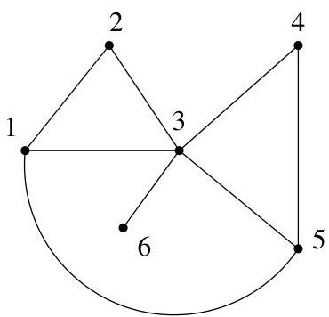

Chapitre II. Un peu de théorie algébrique des graphes

FIGURE II.11. Recherche d'un sous-arbre couvrant.

|  Visite | A | t | j  |
| --- | --- | --- | --- |
|  {v0=1} | ∅ | 0 | 1  |
|  {...,v1=5} | {1,5} | 1 | 2  |
|  {...,v2=3} | {1,5}, {5,3} | 2 | 3  |
|  {...,v3=4} | {1,5}, {5,3}, {3,4} | 3 | 4  |
|  {...,v3=4} | {1,5}, {5,3}, {3,4} | 2 | 4  |
|  {...,v4=2} | {1,5}, {5,3}, {3,4}, {3,2} | 4 | 5  |
|  {...,v4=2} | {1,5}, {5,3}, {3,4}, {3,2} | 2 | 5  |
|  {...,v5=6} | {1,5}, {5,3}, {3,4}, {3,2}, {3,6} | 5 | 6  |

TABLE II.2. Application de l'algorithmme II.5.1.

but est à présent de pouvoir compter le nombre  $\tau(G)$  de tels sous-arbres. Pour répondre à ce problème de dénombrement, plusieurs résultats intermédiaires sont nécessaires. Néanmoins, on peut d'abord obtenir assez facilement une formule récursive permettant de répondre (de manière assez fastidieuse) à la question.

5.1. Une formule de Cayley. Définissons tout d'abord une opération de contraction d'un sommet. Celle-ci va nous permettre de donner une formule récursive pour obtenir  $\tau(G)$ .

Définition II.5.3. Soient  $G = (V, E)$  un multi-graphe (non orienté) et  $e$  une arête de  $G$ . Le graphe obtenu en supprimant l'arête  $e$  et en identifiant les extrémités de celle-ci est appelé contraction de  $G$  (pour l'arête  $e$ ) et se note  $G \cdot e$ .

Si  $G$  est connexe et si  $e$  est une arête qui n'est pas une boucle, il en va de même de sa contraction  $G \cdot e$  qui contient une arête et un sommet de moins que  $G$ .

Proposition II.5.4. Si  $e$  est une arête (qui n'est pas une boucle) d'un multi-graphe connexe (non orienté), alors

$\tau (G) = \tau (G - e) + \tau (G\cdot e).$