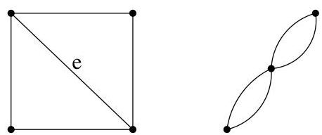
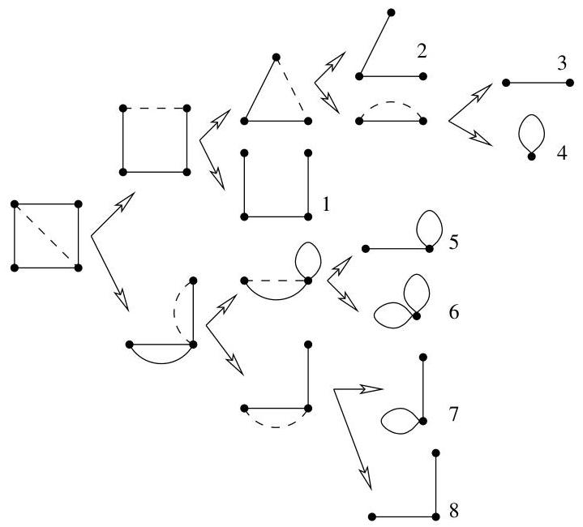

II.5. Arbres couvrants

FIGURE II.12. Contraction d'un graphe  $G$  en  $G \cdot e$ .

Ainsi, cette formule permet d'exprimer  $\tau(G)$  à l'aide de deux graphes plus simples. On arrête la procédure lorsque la suppression d'une arête rend le graphe non connexe (autrement dit, lorsqu'on a un "pseudo"-arbre ne tenant pas compte des évientuelles boucles).

Démonstration. Tout sous-arbre couvrant de  $G$  qui ne contient pas  $e$  est aussi un sous-arbre couvrant de  $G - e$ . Ainsi,  $\tau(G - e)$  compte tous les sous-arbres couvrants de  $G$  qui ne contiennent pas  $e$ .

A chaque sous-arbre couvrant  $A$  de  $G$  qui contient  $e$ , il correspond un sous-arbre couvrant  $A \cdot e$  de  $G \cdot e$  et cette correspondance est une bijection. Ainsi, le nombre de sous-arbres couvrants de  $G$  qui contiennent  $e$  vaut exactement  $\tau(G \cdot e)$ .

Exemple II.5.5. Si on applique la formule de Cayley au graphe suivant de gauche sur la figure II.12, on obtient les décompositions reprises à la figure II.13. A chaque fois, on a représenté en traits pointillés, l'arête à laquelle est appliquée la formule. Ainsi, on s'aperçoit que le nombre d'arbres couvrants pour le graphe de départ vaut 8.

FIGURE II.13. Applications successives de la formule de Cayley.