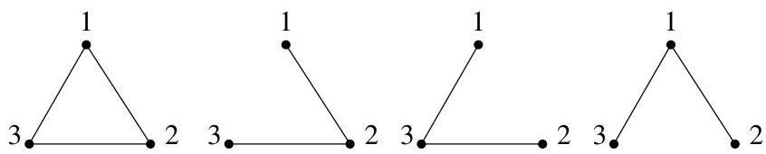

Chapitre II. Un peu de théorie algébrique des graphes

Cet exemple montre bien que cette méthode est difficile àmettre en pratique pour des graphes de grande taille.

5.2. Une preuve bijective. En combinatoire et dans les problèmes de dénombrement, il est parfois aisé de compter le nombre d'éléments d'un ensemble en montrant que cet ensemble (fini) est en bijection avec un autre ensemble plus simple à énumérer ou à dénombreur. Cette méthode assez élégante est illustrée par le dénombrement des sous-arbres couvrants du graphe complet  $K_{n}$ .

Proposition II.5.6 (Cayley (1897)). Le nombre de sous-arbres couvrants du graphe complet  $K_{n}$  vaut  $n^{n - 2}$ . (Le nombre d'arbres à n sommets de labels distincts  $\{1, \ldots, n\}$  vaut  $n^{n - 2}$ .)

Remarque II.5.7. Dans l'énoncé précédent, il faut comprendre que chaque sommet du graphe est pourvu d'un label. A titre d'exemple,  $K_{3}$  possède 3 sous-arbres couvrants comme indiqué à la figure II.14. En effet, bien

FIGURE II.14. Nombre de sous-arbres couvrants.

qu'il s'agisse de trois arbres isomorphes, on les considère comme des arbres distincts à cause des labels portés par les différents sommets. Ainsi, notre formule de comptage va prendre en compte cette distinction!

La preuve donnée ici est à l'origine due à Prüfer. Ainsi, le codage des arbres que nous allonsprésenter est parfois appelé codage de Prüfer.

Démonstration. Numérotons les sommets de  $K_{n}$  de 1 à  $n$ . Il est clair que le nombre de sous-arbres couvrant  $K_{n}$  est égal au nombre d'arbres distincts que l'on peut construire avec des sommets numérotés de 1 à  $n$ . Il nous suffit donc de compter ces arbres.

Nous presentons un encodage (i.e., une bijection) d'un arbre  $A$  par une suite  $s$  de  $n - 2$  symboles appartenant à  $\{1, \ldots, n\}$ . Le nombre de telles suites est bien sur égal à  $n^{n - 2}$ .

Pour obtenir le  $j$ -ème élément de  $s$ , on supprime de  $A$  le plus petit sommet  $a_{j}$  de degré 1 et le  $j$ -ème élément de  $s$  est donné par le sommet adjacent à  $a_{j}$ . Considérons par exemple, l'arbre donné à la figure II.15. Le premier sommet supprimé est 2, son voisin est 1. Ensuite on supprime 5 de voisin 4, puis 4 de voisin 3, puis 3 de voisin 1, puis 1 de voisin 6 et enfin 6 de voisin 7. Cela nous donne la suite  $(1,4,3,1,6,6)$ . De par l'encodage, il est clair que les sommets apparaissant dans  $s$  sont exactement les sommets de degré au moins 2.