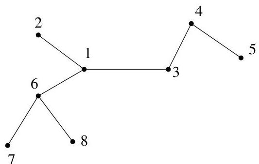
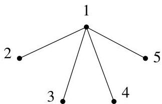

II.5. Arbres couvrants

FIGURE II.15. Un arbre encodé par (1,4,3,1,6,6).

FIGURE II.16. Un arbre encodé par  $(1,1,1)$ .

Réciproquement, si on se donne une suite  $s = (s_1, \ldots, s_{n-2})$  de  $n-2$  éléments de  $V = \{1, \ldots, n\}$ , il lui correspond un arbre  $A$  à  $n$  sommets dont  $s$  est l'encodage. Les sommets de  $V \setminus \{s_1, \ldots, s_{n-2}\}$  sont exactement les sommets de degré 1. Soit  $i_1$  le plus petit élément de  $V \setminus \{s_1, \ldots, s_{n-2}\}$ . L'arête  $\{i_1, s_1\}$  appartient à  $A$ . On recommence: soit  $i_2$  le plus petit élément de  $(V \setminus \{i_1\}) \setminus \{s_2, \ldots, s_{n-2}\}$ . L'arête  $\{i_2, s_2\}$  appartient à  $A$ . A la fin de la procédure,  $V$  contient deux sommets et on ajoute  $A$  l'arête formée par ceux-ci.

Ce résultat peut aussi s'obtenir comme corollaire d'un résultat de dénombrement plus général : compte le nombre d'arbres dont les sommets ont des labels distincts et les degrés sont fixés.

Théorème II.5.8. Le nombre d'arbres ayant  $n$  sommets de label respectif  $x_{1},\ldots ,x_{n}$  et dont les degrés sont disponibles par  $\deg (x_1) = d_1,\dots ,\deg (x_n) = d_n$  vaut le coefficient multinomial

$$
T _ {n, d _ {1}, \ldots , d _ {n}} := \left( \begin{array}{c} n - 2 \\ d _ {1} - 1, \dots , d _ {n} - 1 \end{array} \right) = \frac {(n - 2) !}{(d _ {1} - 1) ! \cdots (d _ {n} - 1) !},
$$

à condition qu'un arbre ayant de telles spécificités existe25.

Exemple II.5.9. Pour les arbres donnés à la figure II.14 de la remarque II.5.7, il y a un seul arbre à 3 sommets de label 1,2,3 et de degré respectif 2,1,1 (il y en a aussi un pour les degrés 1,2,1 et 1,1,2). La formule donne