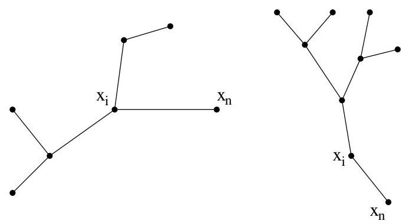

Chapitre II. Un peu de théorie algébrique des graphes

bien

$$
\left( \begin{array}{c} 3 - 2 \\ 2 - 1, 1 - 1, 1 - 1 \end{array} \right) = \frac {1 !}{1 ! 0 ! 0 !} = 1.
$$

Démonstration. Commençons par quelques remarques préliminaires. Au vu de la remarque I.2.3,

$$
d _ {1} + \dots + d _ {n} = 2 \# E = 2 (n - 1).
$$

Donc,  $T \neq 0$  (i.e., il y a au moins un arbre correspondant aux données de l'énoncé) si et seulement si

$$
\sum_ {i = 1} ^ {n} (d _ {i} - 1) = 2 (n - 1) - n = n - 2.
$$

De plus, pour tout  $i$ ,  $1 \leq d_i \leq n - 1$ . Il existe une permutation  $\nu$  des sommets qui est telle que  $d_{\nu_1} \geq \dots \geq d_{\nu_n}$ . Pour simplifier l'écriture et ne rien changer au raisonnement, nous allons supposer que  $d_1 \geq d_2 \geq \dots \geq d_n$ . Au vu de l'égalité précédente, on en conclus que  $d_n = 1$ . En effet, si  $d_n \geq 2$ , alors  $\sum_{i=1}^{n} (d_i - 1) \geq 2n - n \geq n$ , ce qui est impossible au vu de la formule ci-dessus.

On a

$$
T _ {n, d _ {1}, \dots , d _ {n}} = \sum_ {i: d _ {i} \geq 2} T _ {n - 1, d _ {1}, \dots , d _ {i - 1}, d _ {i} - 1, d _ {i + 1}, \dots , d _ {n - 1}}.
$$

En effet, puisque  $x_{n}$  est de degré 1, on considère la famille  $C_i$  des arbres ayant  $x_{1},\ldots ,x_{n}$  pour sommets de degré respectif  $d_1,\dots ,d_n$  et dont le sommet  $x_{i}$  est de degré au moins 2 et pour lequel  $\{x_i,x_n\}$  est une arête de l'arbre. (Une illustration est donnée à la figure II.17.) Pour un  $i$  fixé, il suffit donc pour

FIGURE II.17. Deux arbres de  $C_i$  pour lesquels  $d_i = 2$  et  $d_i = 3$ .

énumérer les arbres de  $C_i$  d'énumérer les arbres ayant  $n - 1$  sommets de label  $x_1, \ldots, x_{i-1}, \mathbf{x_i}, x_{i+1}, \ldots, x_{n-1}$  et de degré  $d_1, \ldots, d_{i-1}, \mathbf{d_i} - \mathbf{1}, d_{i+1}, \ldots, d_{n-1}$ .

Nous pouvons à présent démontré le résultat annoncé en procédant par récurrence. Le cas de base  $n = 2$  est immédiat. Supposons donc  $n \geq 3$  et la