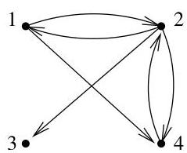
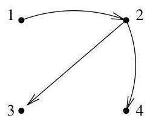

II.5. Arbres couvrants

FIGURE II.18. Un sous-arbre couvrant pointé et orienté.

Autrement dit,  $[D(G)]_{i,j}$  est l'opposé du nombre d'arcs joignant  $v_{i}$  à  $v_{j}$ , si  $i \neq j$ . En conséquence de cette définition, il est clair que la somme des éléments de toute colonne de  $D(G)$  est nulle.

Example II.5.15. Pour le graphe de la figure II.18, on trouve

$$
D (G) = \left( \begin{array}{c c c c} 1 &amp; - 1 &amp; 0 &amp; - 1 \\ - 1 &amp; 2 &amp; - 1 &amp; - 1 \\ 0 &amp; 0 &amp; 1 &amp; 0 \\ 0 &amp; - 1 &amp; 0 &amp; 2 \end{array} \right).
$$

Remarque II.5.16. La matrice de demi-degré entrant associée à un sous-arbre couvrant pointé et orienté possède, à l'exception de la colonne correspondant à la racine, exactement un “-1” dans chaque colonne et une diagonale formée de 1 (on aboutit exactement une fois dans chaque sommet). La colonne correspondant à la racine est nulle puisqu'aucun arc n'aboutit à la racine. Ainsi, pour le sous-arbre de la figure II.18, on a la matrice

$$
M = \left( \begin{array}{c c c c} 0 &amp; - 1 &amp; 0 &amp; 0 \\ 0 &amp; 1 &amp; - 1 &amp; - 1 \\ 0 &amp; 0 &amp; 1 &amp; 0 \\ 0 &amp; 0 &amp; 0 &amp; 1 \end{array} \right).
$$

Nous allons introduire des sous-graphes particuliers de  $G$ . Soient  $i \in \{1, \ldots, n\}$  et  $G^{(i)} = (V, E \setminus \omega^{-}(v_i))$ , i.e., le sous-graphe obtenu en supprimant les arcs de  $G$  entrant dans  $v_i$ . Un tel sous-graphe revient à sélectionner une racine pour un arbre couvrant potentiel (en effet, aucun arc n'aboutit à la racine).

Example II.5.17. Pour le graphe de la figure II.18, on trouve par exemple

$$
D (G ^ {(3)}) = \left( \begin{array}{c c c c} 1 &amp; - 1 &amp; 0 &amp; - 1 \\ - 1 &amp; 2 &amp; 0 &amp; - 1 \\ 0 &amp; 0 &amp; 0 &amp; 0 \\ 0 &amp; - 1 &amp; 0 &amp; 2 \end{array} \right).
$$

Si  $[D(G^{(i)})]_{k,k} = r_k^{(i)}\geq 2$  , alors on peut écrire, de maniere unique, la  $k$  -ieme colonne de  $D(G^{(i)})$  comme une somme de  $r_k^{(i)}$  vecteurs-colonnes

$$
C _ {k, 1} ^ {(i)}, \ldots , C _ {k, r _ {k} ^ {(i)}} ^ {(i)}
$$