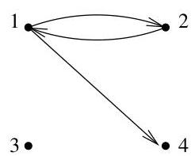
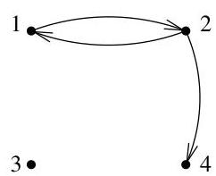
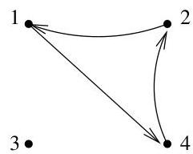
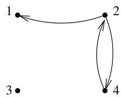

II.5. Arbres couvrants

FIGURE II.19. Graphes correspondant aux matrices  $D_1^{(3)}, D_2^{(3)}, D_3^{(3)}$  et  $D_4^{(3)}$ .

Exemple II.5.20. Aux matrices  $D_1^{(3)}, D_2^{(3)}, D_3^{(3)}$  et  $D_4^{(3)}$  de l'exemple précédent, correspondent les graphes de la figure II.19.

Remarque II.5.21. Supposons qu'un sous-arbre couvrant pointé en  $v_{i}$  et orienté existe. Alors, au vu de la remarque II.5.16, la matrice associée à cet arbre est exactement égale à une des matrices  $D^{(i)}_1, \ldots, D^{(i)}_{m^{(i)}}$ . Pour compter le nombre de sous-arbres couvrants pointés en  $v_{i}$ , il suffit donc de pouvoir désigner les matrices  $D^{(i)}_j$  qui correspondent à un sous-arbre couvrant de celles qui n'y correspondent pas.

Toute matrice  $D^{(i)}_j$  est une matrice de demi-degré entrant pour un certain sous-graphe de  $G$ , note  $G^{(i)}_j$ , dont chaque sommet a un demi-degré entrant valant au plus 1.

Théorème II.5.22. Soit  $G = (V, E)$  un graphe orienté dont le demi-degré entrant de chaque sommet vaut au plus 1. Le mineur  $M_{t,t}(G)$  de la matrice  $D(G)$  obtenu en supprimant la ligne et la colonne correspondant à  $v_t$  vaut

1, si  $G$  contient un sous-arbre couvrant pointé en  $v_{t}$  et orienté; 0, sinon.

Démonstration. Supposons que  $G$  contienne un sous-arbre couvrant  $A$  orienté et pointé en  $v_{t}$ . Puisque par hypothèse, le demi-degré entrant de chaque sommet vaut au plus 1, alors  $G = A$  ou bien  $G = A + e$  où  $e$  est une arête entrant dans  $v_{t}$ . On peut renumerer les sommets de  $A$  (donc de  $G$ ) par un parcours en largeur de l'arbre. Ainsi, l'arête  $v_{t}$  devient  $v_{1}$  et  $[D(G)]_{1,1} \leq 1$ . Pour  $i \geq 2$ ,  $[D(G)]_{i,i} = 1$  et

$$
\mathrm {s i} i &gt; j \geq 2, \mathrm {a l o r s} [ D (G) ] _ {i, j} = 0
$$

(c'est une conséquence de la renumeration des sommets). Si  $G = A + e$ , alors  $D(G)$  contient un “-1” dans la première colonne, mais cela n'a guère d'importance pour la suite. On conclut que la matrice  $D(G)$  privée de