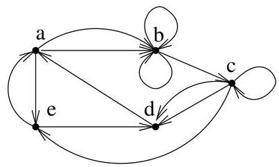

I.1. Graphes orientés

et  $\omega^{-}(d) = \{(c,d),(e,d)\}$ . On a aussi  $\operatorname{succ}(a) = \{b,e\}$ ,  $\operatorname{succ}(b) = \{b,c\}$ ,  $\operatorname{pred}(d) = \{c,e\}$  et  $\nu(a) = \{b,d,e\}$ . On voit aussi que les arcs  $(e,a)$  et  $(d,a)$  sont adjacents. Enfin, le demi-degré sortant de  $c$  est  $d^{+}(c) = 3$ .

Définition I.1.5. Un multi-ensemble $^4$  est un ensemble au sein duquel un même élément peut être répété plus d'une fois. Ainsi, on s'intéresse non seulement à savoir si un élément appartient ou non à un multi-ensemble donné, mais également à sa multiplicité. Par exemple,  $\{1,1,2,3\}$ ,  $\{1,2,3\}$  et  $\{1,2,2,3\}$  sont des multi-ensembles distincts. Pour désigner les copies d'un même élément  $x$ , il est commode de les indicier. Par exemple, on considère le multi-ensemble  $\{1_1,1_2,1_3,2_1,2_2,3\}$ . Cette manière de procéder nous permettra de définir facilement des fonctions définies sur un multi-ensemble.

Un multi-graphe  $G = (V, E)$  est un graphe pour lequel l'ensemble  $E$  des arcs est un multi-ensemble. Autrement dit, il peut exister plus d'un arc reliant deux sommets donnés. Un exemple de représentation d'un multi-graphe est donné à la figure I.3. Un multi-graphe  $G = (V, E)$  est fini si  $V$

FIGURE I.3. Un exemple de multi-graphe.

et  $E$  sont finis. (En effet, dans le cas des multi-graphes, supposer  $V$  fini n'implique pas que  $E$  soit fini.)

Soit  $p \geq 1$ . Un  $p$ -graphe est un multi-graphe  $G = (V, E)$  pour lequel tout arc de  $E$  est repété au plus  $p$  fois. En particulier, un 1-graphe est un graphe.

Remarque I.1.6. On peut observer que la remarque I.1.2, la définition I.1.3 et la "handshaking formula" s'appliquent également au cas des multi-graphes. Il est laissé au lecteur le soin d'adapter les définitions de  $\omega^{+}(v)$ ,  $d^{+}(v)$ ,  $\operatorname{succ}(v)$  et  $\omega^{-}(v)$ ,  $d^{-}(v)$ ,  $\operatorname{pred}(v)$ . En particulier,  $\omega^{+}(v)$  et  $\omega^{-}(v)$  sont en général des multi-ensembles.

Définition I.1.7. Un graphe  $G = (V, E)$  est dit simple (ou strict) s'il ne s'agit pas d'un multi-graphe et si  $E$  est irréflexif, c'est-à-dire que quel que soit  $v \in V$ ,  $(v, v)$  n'appartient pas à  $E$  (i.e.,  $G$  ne contient pas de boucle). Un exemple de graphe simple est donné à la figure I.4.