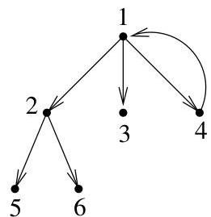
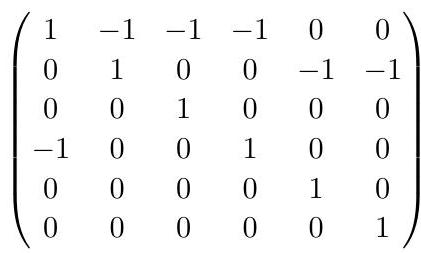
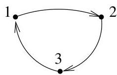
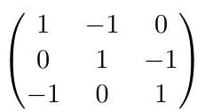

Chapitre II. Un peu de théorie algébrique des graphes

sa première ligne et de sa première colonne est une matrice triangulaire supérieure de déterminant 1.

FIGURE II.20. Un arbre pointé parcouru en largeur (avec un arc supplémentaire).

Supposons à présent que  $G$  ne contienne pas de sous-arbre couvrant orienté et pointé en  $v_{t}$ . Si pour  $j \neq t$ ,  $d^{-}(v_{j}) = 0$ , alors la  $j$ -ème colonne de  $D(G)$  est nulle et on en conclus que  $M_{t,t}(G) = 0$ . Nous pouvons donc supposer que pour tout  $j \neq t$ ,  $d^{-}(v_{j}) = 1$ .

Soit  $j_1 \neq t$ . Puisque  $d^{-}(v_{j_1}) = 1$ , il existe un indice  $j_2$  et un arc joignant  $v_{j_2}$  à  $v_{j_1}$ . En continuant de la sorte, on obtient des sommets tous distincts  $v_{j_k}, \ldots, v_{j_1}$  tels que

$$
v _ {j _ {k}} \longrightarrow v _ {j _ {k - 1}} \longrightarrow \dots \longrightarrow v _ {j _ {2}} \longrightarrow v _ {j _ {1}}.
$$

Si en effectuant cette construction, on rencontres le sommet  $v_{t}$ , on considère alors un autre sommet que  $v_{j_1}$  pour initiaiser la construction. Nous affirmons qu'il existe au moins un sommet de  $G$  pour lequel la construction ne rencontres pas  $v_{t}$ . En effet, si ce n'était pas le cas, on aurait identifié à chaque fois un sous-arbre pointé en  $v_{t}$  et on obtiendrait des lors un sous-arbre couvrant pointé en  $v_{t}$ , ce qui n'est pas possible dans la situation envisagée ici. Dans la construction de  $v_{j_k},\ldots ,v_{j_1}$ , puisque le graphe contient un nombre fini de sommets, on finit par identifier un cycle. Les colonnes de  $D(G)$  correspondant aux sommets de ce cycle sont linéairement dépendantes car leur somme fait zéro. De là, on en conclus que  $M_{t,t}(G) = 0$ .

FIGURE II.21. Un cycle et des colonnes dont la somme est nulle.

Les graphes  $G^{(i)}_j$  satisfont l'hypothèse du théorème II.5.22. Au vu de ce théorème et de la remarque II.5.21, le nombre de sous-arbres couvrant  $G^{(i)}$  pointés en  $v_i$  vaut

$$
\sum_ {j = 1} ^ {m ^ {(i)}} M _ {i, i} (G ^ {(i)} _ {j}) = M _ {i, i} (G ^ {(i)}).
$$