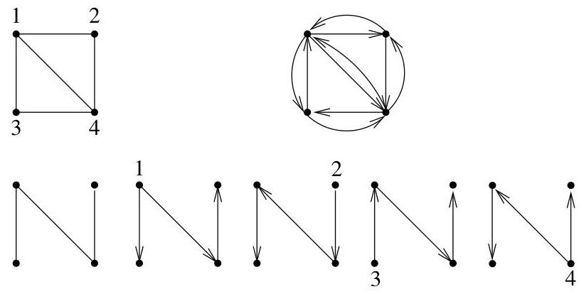

II.5. Arbres couvrants

On a utilisé un raisonnement analogue à (8) appliqué ici au calcul d'un mineur. Ce nombre est aussi, bien évidemment, égal au nombre de sous-arbres couvrant  $G$  tout entier et pointés en  $v_{i}$ . Les matrices  $D(G^{(i)})$  et  $D(G)$  étant égales à l'exception de la  $i$ -ème colonne, on obtient le résultat suivant.

Théorème II.5.23 (Bott-Mayberry (1954)). Soit  $G$  un multi-graphe orienté sans boucle. Le nombre de sous-arbres couvrant  $G$  pointés au sommet  $v_{i}$  et orientés est égal au mineur  $M_{i,i}(G)$  de la matrice de demi-degré entrant de  $G$ .

Nous pouvons à présent reconsiderer notre problème initial concernant des graphes non orientés. A un graphe non orienté  $G = (V, E)$  correspond un graphe orienté  $G = (V, E')$  où chaque arête  $\{u, v\}$  de  $G$  donne lieu aux arcs  $(u, v)$  et  $(v, u)$  dans  $G'$ . Il est clair qu'à tout arbre couvrant dans  $G$ , il correspond dans  $G'$  exactement un arbre couvrant pointé en  $a$  et orienté depuis  $a$  et ce, pour tout sommet  $a$  de  $G'$ . La reciproque est également vraie. A tout arbre couvrant  $G'$  (pointé en un quelconque sommet et orienté), il correspond un arbre couvrant  $G$ .

Corollaire II.5.24. Le nombre de sous-arbres couvrant un multi-graphe  $G = (V, E)$  non orienté sans boucle vaut  $M_{i,i}(G')$  quel que soit  $i$ , où  $G'$  est le graphe symétrique orienté déduit de  $G$ .

Exemple II.5.25. Sur la figure II.22, on a représenté un graphe non orienté  $G$ , le graphe orienté symétrique  $G'$  correspondant à  $G$ , ainsi qu'un arbre couvrant  $G$  et les arbres couvrants correspondants dans  $G'$  avec comme racines respectives les différents sommets de  $G'$ .

FIGURE II.22. Nombre de sous-arbres couvrants pour  $G$  et  $G'$ .

$$
D (G ^ {\prime}) = \left( \begin{array}{c c c c} 3 &amp; - 1 &amp; - 1 &amp; - 1 \\ - 1 &amp; 2 &amp; 0 &amp; - 1 \\ - 1 &amp; 0 &amp; 2 &amp; - 1 \\ - 1 &amp; - 1 &amp; - 1 &amp; 3 \end{array} \right).
$$