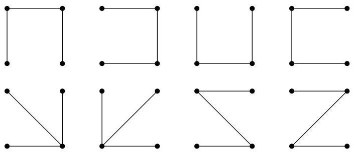

Chapitre II. Un peu de théorie algébrique des graphes

On vérifie que tous les mineurs principaux valent 8. On a ainsi 8 arbres couvrants distincts ( comme le montre la figure II.23). Insistons une fois


FIGURE II.23. Les sous-arbres couvrants du graphe  $G$ .

encore sur le fait que nous avons compté l'ensemble des sous-arbres d'un graphe dont les sommets ont été numérotés. Ainsi, parmi les 8 arbres trouvés ci-dessus, seulement 3 sont 2 à 2 non isomorphes.

# 6. Arbres couvrants de poids minimal

Nous allons à présent considérer le problème de trouver non seulement un sous-arbre couvant mais un sous-arbre couvant de poids minimal. Rappelons que l'on se restreint au cas de graphes (non orientés) simples. (En effet, si on disposait de plusieurs arêtes joignant deux sommets, il suffirait de conserver l'arête de plus petit poids.) L'algorithmme de Prim répond à cette question.

Soit  $G = (V, E)$  un graphe connexe non orienté dont les arêtes sont pondérées par une fonction  $p: E \to \mathbb{R}^+$ . L'idée de cet algorithme est de construire le sous-arbre de proche en proche. Si on dispose déjà d'un sous-graphe  $G' = (V', A)$  connexe d'un arbre de poids minimal couvant  $G$ , on lui ajoute une arête de poids minimal parmi les arêtes joignant un sommet de  $V'$  à un sommet de  $V \setminus V'$ . Puisqu'il faut couvrir l'arbre tout entier, on débute la procédure avec un sous-graphe restreint à une quelconque arête de  $G$ .

Nous utilisons les mêmes conventions qu'à la remarque I.4.9. Ainsi,  $p(\{u,v\}) = +\infty$  si  $\{u,v\} \notin E$ .

Algorithm II.6.1 (Prim). La donnée de l'algorithmie est un graphe connexe non orienté  $G = (V, E)$ .

```latex
Choisir un sommet  $v_{0}\in V$ $\mathrm{V}^{\prime}:=\{v_{0}\}$  ，A:=0
Pour tout  $v\in V\setminus V^{\prime}$  L(v):=p({v0,v})
Tant que  $\mathrm{V}^{\prime}\neq V$  ，repeeter
Choisir  $u\in V\setminus V^{\prime}$  tel que L(u) soit minimal et e l'arête réalisant ce poids
$\mathrm{V}^{\prime}:=\mathrm{V}^{\prime}\cup\{u\}$