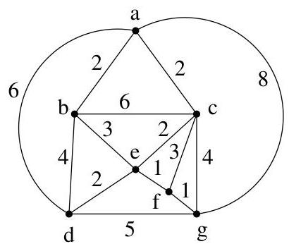
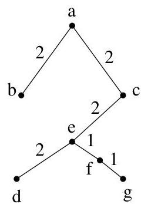

II.6. Arbres couvrants de poids minimal

```txt
A:=AU{e}
Pour tout  $v\in V\setminus V^{\prime}$  si  $p(\{u,v\}) &lt;   \mathrm{L}(v)$  , alors L(v):=p({u,v})
```


Exemple II.6.2. Appliquons l'algorithmme au graphe de la figure II.24.


FIGURE II.24. Application de l'algorithmme de Prim.

|  V' | A | L(a) | L(b) | L(c) | L(d) | L(e) | L(f) | L(g)  |
| --- | --- | --- | --- | --- | --- | --- | --- | --- |
|  {a} | ∅ | - | 2 | 2 | 6 | +∞ | +∞ | 8  |
|  {a,b} | {{a,b}} | - | - | 2 | 4 | 3 | +∞ | 8  |
|  {a,b,c} | {..., {a,c}} | - | - | - | 4 | 2 | 3 | 4  |
|  {a,b,c,e} | {..., {c,e}} | - | - | - | 2 | - | 1 | 4  |
|  {a,b,c,e,f} | {..., {e,f}} | - | - | - | 2 | - | - | 1  |
|  {a,b,c,e,f,g} | {..., {f,g}} | - | - | - | 2 | - | - | -  |
|  {a,b,c,e,f,g,d} | {..., {d,e}} | - | - | - | - | - | - | -  |

TABLE II.3. Application de l'algorithmme de Prim.

Démonstration. On procède par récurrence sur  $\# V'$ , le cas de base  $\# V' = 1$  étant immédiat. Le choix de l'arête  $e$  joignant un sommet de  $V'$  à un sommet de  $V \setminus V'$  assure que l'on obtienne un arbre. En effet, si  $G' = (V', A)$  est un arbre, il ne contient pas de cycle et l'arête  $e$  ajoutée ne saurait créé un cycle. Ainsi  $G' + e$  est encore un arbre.

Par hypothèse de récurrence,  $G'$  est un sous-arbre d'un arbre  $T$  couvrant  $G$  et de poids minimal. Supposons que  $e$  ne soit pas une arête de  $T$ . Ainsi,  $T + e$  contient un cycle contenant  $e$  mais aussi une autre arête  $e'$  joignant un sommet de  $V'$  à un sommet de  $V \setminus V'$ . Considérons l'arbre  $S = (T + e) - e'$ . Il s'agit encore d'un arbre couvrant. De par les可以选择 réalisés dans l'algorithmme, son poids

$$
p (S) = p (T) + p (e) - p \left(e ^ {\prime}\right)
$$