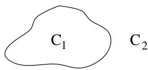

# CHAPITRE III

# Graphes planaires

# 1. Introduction

Dans ce chapitre, on considère uniquement des graphes non orientés. En effet, l'orientation ne joue aucun role par rapport aux questions de planarité. Attirons de plus l'attention du lecteur sur le fait que la plupart des résultats ( comme la formule d'Euler) ne sont applicables qu'à des graphes finis.

Definition III.1.1. Un multi-graphe  $G$  est planaire (ou planaire topologique) s'il est possible de le représentier dans le plan affin euclidien de manière telle que les sommets distincts de  $G$  soient des points distincts du plan et les arêtes soient des courbes simples $^{1}$ . On impose en plus que deux arêtes distinctes ne se rencontres pas en dehors de leurs extrémités. On parlera alors de représentation planaire de  $G$ .

On ne considérera pas comme distinctes deux représentations planaires que l'on peut amener à coïncider par "déformation élastique du plan"2

Remarque III.1.2. Un même graphe planaire peut avoir plusieurs représentations planaires distinctes (cf. figure III.4).

Remarque III.1.3. Pour rappel, le théorème de Jordan stipule que pour toute courbe simple fermée  $\Gamma$ ,  $\mathbb{R}^2 \setminus \Gamma$  possède exactement deux composantes connexes. Cela va donc nous permettre de définir la notion de face de manière rigoureuse. En effet, un circuit simple détermine une courbe simple.

FIGURE III.1. Théorème de Jordan

Définition III.1.4. Soit  $G$  un multi-graphe planaire. Une face de  $G$  est une région du plan délimitée par des arêtes formant un circuit simple. Par conséquent, deux points arbitraires de cette région peuvent être joints par un