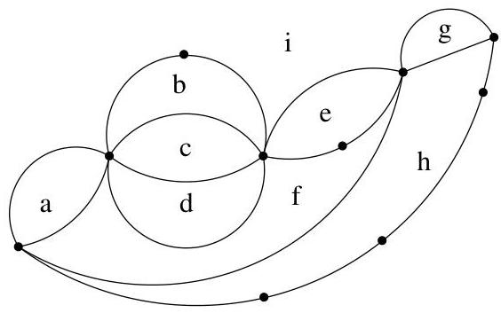

Chapitre III. Graphes planaires

trait continu ne rencontres aucun sommet ni arête de  $G$ . La frontière  $\partial F$  d'une face  $F$  est l'ensemble des arêtes qui "touchent" la face (on omet donc les sommets). Par extension et pour simplifier notre exposé, on s'autorisera à parler des sommets et des arêtes appartenant à une face (si les arêtes appartiennent à la frontière de la face considérée ou si un sommet est une extrémité d'une telle arête). Deux faces  $F$  et  $F'$  sont adjacentes si leur frontière ont au moins une arête commune, i.e.,  $\partial F \cap \partial F' \neq \emptyset$ . En particulier, deux faces ne se touchant que par un sommet ne sont pas considérées comme adjacentes. Un multi-graphe planaire (fini) contient toujours une et une seule face infinie, i.e., non bornée. On peut néanmoins toujours parler de la frontière de la face infinie.

FIGURE III.2. Un graphe planaire et ses faces.

Remarque III.1.5. A titre indicatif, citons le théorème de Steinitz (1922). Rappelons que le squelette d'un polyèdre  $P$  est le graphe dont les sommets sont les sommets de  $P$  et dont les arêtes sont aussi celles de  $P$ . Par exemple, le graphe de gauche à la figure I.13 est le squelette d'un cube. Le résultat s'énonce comme suit. Un graphe est le squelette d'un polyèdre convexe (borné) de  $\mathbb{R}^3$  si et seulement si c'est un graphe planaire au moins 3-connexe (i.e., ne pouvant pas être disconnecté en retirant moins de trois sommets,  $\kappa(G) \geq 3$ ).

Proposition III.1.6. Si  $G$  est un multi-graphe planaire et  $\Delta$  une face de  $G$ . Il est possible d'obtenir une représentation planaire du graphe  $G$  dans le plan affin euclidien de manière telle que  $\Delta$  soit la face infinie. En particulier, pour tout sommet  $x$  de  $G$ , on peut obtenir une représentation planaire du graphe  $G$  telle que  $x$  appartienne à la face infinie.

Démonstration. Par projection stéréographique (cf. figure IV.3), on se ramène à une représentation du graphe sur la sphère et inversement. Par rotation (cf. figure III.3), on peut toujours amener la face  $\Delta$  à contenir le pôle de la projection. Il s'agit d'un argument purement géométrique.