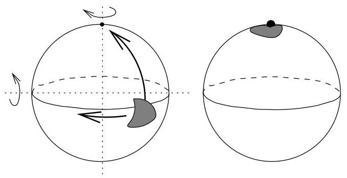
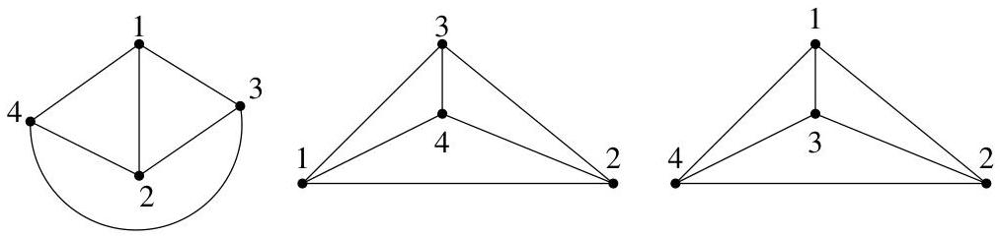

III.2. Formule d'Euler

FIGURE III.3. Rotation sur la sphère

Exemple III.1.7. A la figure III.4, on a représenté un même graphe et à chaque fois, la face infinie est différente. Dans le premier cas, la frontière de la face infinie est donnée par  $\partial F = \{\{1,4\}, \{4,3\}, \{3,1\}\}$  et dans les deux autres cas par  $\partial F = \{\{1,3\}, \{3,2\}, \{2,1\}\}$  et  $\partial F = \{\{1,2\}, \{2,4\}, \{4,1\}\}$ .

FIGURE III.4. Choix de la face infinie.

# 2. Formule d'Euler

Le théorème suivant peut parfois être utilisé pour vérifier qu'un graphe donné n'est pas planaire. En effet, c'est principalement grâce à ce résultat que nous montrerons que ni  $K_{5}$  ni  $K_{3,3}$  ne sont planaires.

Théorème III.2.1 (Formule d'Euler $^4$ ). Dans un multi-graphe planaire connexe (fini) possédant s sommets, a arêtes et  $f$  faces, on a

$$
\boxed {s - a + f = 2.}
$$

Démonstration. On procède par récurrence sur le nombre  $f$  de faces. Si  $f = 1$ , le graphe possède uniquement une face infinie. Par conséquent, le graphe connexe ne possède aucun cycle, il s'agit d'un arbre. Ainsi,  $s = a + 1$  et la formule est vérifiée.

Supposons à présent la formule d'Euler satisfaite pour les valeurs  $&lt; f$  et démontrons-la pour  $f \geq 2$ . Soit  $e$  une arête d'un cycle du graphe. Cette