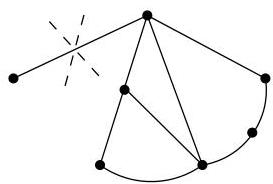

Chapitre III. Graphes planaires

arête appartient à la frontière de deux faces  $A$  et  $B$ . Si on supprime l'arête  $e$ , on obtient un nouveau graphe ayant  $a - 1$  arêtes, le même nombre  $s$  de sommets et  $f - 1$  faces (en effet,  $A$  et  $B$  forment une face de ce nouveau graphe). Par hypothèse de récurrence, on a  $s - (a - 1) + f - 1 = 2$  ce qui suffit.

Exemple III.2.2. Pour le graphe de la figure III.2, on a  $s = 10$ ,  $a = 17$  et  $f = 9$ .

Le simple argument de comptage utilisé dans la preuve du résultat suivant nous sera utile à plusieurs reprises dans la suite de ce chapitre.

Corollaire III.2.3. Dans un graphe  $G = (V, E)$  simple et planaire, il existe un sommet  $x$  tel que  $\deg(x) \leq 5$ .

Démonstration. Quitte à considérer séparément chaque composante connexe de  $G$ , nous allons supposer  $G$  connexe. On peut tout d'abord éliminer les arêtes ne délimitant pas de face (celles-ci ont une extrémité de degré 1 et le résultat est alors immédiat, cf. figure III.5). Cela ne fait que renforcer encore le résultat.

FIGURE III.5. Suppression d'arêtes.

Puisque  $G$  est simple, la frontière de toute face contient au moins 3 arêtes. Donc en comptant le nombre de faces, on compte à chaque fois au moins 3 arêtes, ainsi,  $3f \leq a$ . On peut même dire plus car, dans ce comptage, chaque arête est comptée deux fois puisqu'elle apparait dans la frontière de deux faces. On en conclus donc que

(9)

Procedons par l'absurde et supposons que pour tout sommet  $x$  de  $G$ ,  $\deg(x) \geq 6$ . Dans ce cas,

$$
s \leq \frac {2 a}{6}.
$$

Si on applique la formule d'Euler,

$$
2 = s - a + f \leq \frac {a}{3} - a + \frac {2 a}{3} = 0
$$

et on obtient une absurdité.