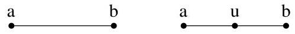
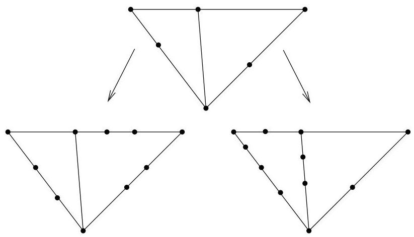

III.3. Graphes homéomorphes

# 3. Graphes homéomorphes

Nous définissons ici la notion de graphes homéomorphes nécessaire à l'énoncé du théorème de Kuratowski.

Definition III.3.1. La subdivision d'une arête  $e = \{a, b\}$  d'un graphe  $G = (V, E)$  consiste à replacer cette arête par deux nouvelles arêtes  $e_1 = \{a, u\}$  et  $e_2 = \{u, b\}$  où  $u$  est un nouveau sommet n'appartenant pas à  $V$ . Le

FIGURE III.6. Subdivision d'une arête.

graphe obtenu est alors  $G' = (V \cup \{u\}, (E \cup \{e_1, e_2\}) \setminus \{e\})$ .

Definition III.3.2. Deux graphes sont homéomorphes s'ils peuvent être obtenus par une suite finie (voir vide) de subdivisions à partir d'un même graphe. En particulier, si un graphe  $G'$  résultat de subdivisions d'arêtes de  $G$ , alors  $G$  et  $G'$  sont homéomorphes.

Example III.3.3. La figure III.7 reprend deux graphes homéomorphes construits à partir d'un même graphe.

FIGURE III.7. Graphes homéomorphes.

Remarque III.3.4. On se convainc assez facilement que la relation “être homéomorphe” est une relation d'équivalence sur l'ensemble des multi-graphes finis (non orientés). Dans une classe d'équivalence, on peut considérer le graphe ayant un nombre minimum d'arêtes (ou de sommets).