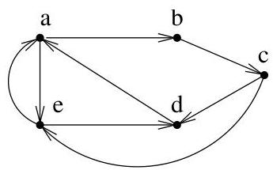

Chapitre I. Premier contact avec les graphes

FIGURE I.4. Un exemple de graphe simple.

# 2. Graphes non orientés

Les graphes non orientés sont en fait un cas particulier de graphes (orientés).

Definition I.2.1. Soit  $G = (V, E)$  un graphe (resp. un multi-graphe). Si  $E$  est une relation symétrique sur  $V$ , on dira que  $G$  est un graphe (resp. un multi-graphe) non dirigé ou non orienté. Autrement dit,  $G$  est non dirigé si

$$
\forall v _ {1}, v _ {2} \in V: (v _ {1}, v _ {2}) \in E \Rightarrow (v _ {2}, v _ {1}) \in E.
$$

Dans ce cas, on simplifie la représentation sagittale de  $G$  en traçant simplement un segment entre  $v_{1}$  et  $v_{2}$ . Pour alléger l'écriture, on identifiera les arcs  $(v_{i}, v_{j})$  et  $(v_{i}, v_{j})$  avec une unique "arête non orientée" donnée par la paire  $\{v_{i}, v_{j}\}$ . Dans le cas dirigé (resp. non dirigé), nous nous efforcerons de parler d'arcs (resp. d'arêtes).

Si par contre, on désire insister sur le caractère non symétrique de  $E$ , on parlera de graphe dirigé ou, par abus de langage, digraphé.

Les définitions rencontres précédemment s'adaptent aisément au cas non orienté.

Definition I.2.2. Soient  $G = (V, E)$ , un multi-graphe non orienté et  $a = \{v_i, v_j\}$  une de ses arêtes. On dit que  $a$  est incident aux sommets  $v_i$  et  $v_j$ . Le nombre d'arêtes incidentes à  $v_i$  est le degré de  $v_i$ , noté  $\deg(v_i)$ . On suppose en outre que les boucles apportent une double contribution au degré d'un sommet. L'ensemble des arêtes incidentes à  $v_i$  se note  $\omega(v_i)$ . Il est clair que, dans un graphe simple,  $\deg(v_i) = \#(\omega(v_i))$ . Ces notations sont bien évidemment compatibles avec celles données dans le cas orienté. Deux arêtes sont adjacentes si elles ont au moins une extrémité en commun.

Deux sommets  $v_{i}, v_{j} \in V$  sont adjacents si l'arête  $\{v_{i}, v_{j}\}$  appartient à  $E$ . On dit aussi qu'ils sont voisins. L'ensemble des voisins de  $v$  se note  $\nu(v)$ . Enfin, la définition d'un  $p$ -graphe est analogue à cette donnée dans le cas orienté.

Remarque I.2.3 (Handshaking lemma). Si  $G = (V, E)$  est un multi-graphe non orienté, alors

$$
\sum_ {v \in V} \deg (v) = 2 \# E.
$$