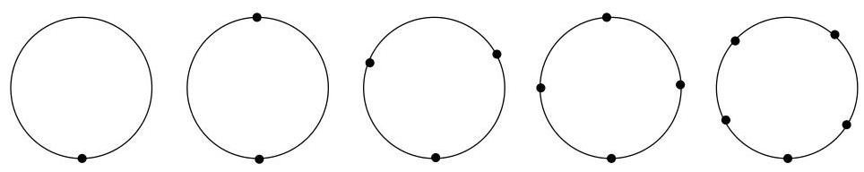

Chapitre III. Graphes planaires

FIGURE III.8. Graphes homéomorphes.

# 4. Théorème de Kuratowski

Les graphes  $K_{5}$  et  $K_{3,3}$  sont l'archétype même des graphes non planaires.

Lemma III.4.1. Le graphe  $K_{5}$  n'est pas planaire.

Démonstration. On utilise les notations de la formule d'Euler. D'une manière générale, dans un graphe simple et planaire, de la relation  $3f \leq 2a$  démontrée en (9) et de la formule d'Euler ( $3a - 3f = 3s - 6$ ), on tire que

$$
a \leq 3 s - 6.
$$

Or,  $K_{5}$  est un graphe simple qui possède 5 sommets et 10 arêtes et  $10 \not\leq 3.5 - 6$ . On en conclus que  $K_{5}$  ne peut être planaire.

Lemma III.4.2. Le graphe  $K_{3,3}$  n'est pas planaire.

Démonstration. On utilise une fois encore le même raisonnement que celui ayant permis d'obtenir la relation (9), mais cette fois dans un graphe simple, planaire et biparti. Dès lors, chaque face a une frontière déterminée par au moins 4 arêtes et on en tire que  $4f \leq 2a$ , i.e.,  $2f \leq a$ . De la formule d'Euler,  $2a - 2f = 2s - 4$ , on en tire que

$$
a \leq 2 s - 4.
$$

Or,  $K_{3,3}$  est un graphe biparti simple qui possède 6 sommets et 9 arêtes. Il ne peut donc pas être planaire car  $9 \not\leq 2.6 - 4$ .

Théorème III.4.3. Un multi-graphe (non orienté) est planaire si et seulement si il ne contient pas de sous-graphe homéomorphe à  $K_{5}$  ou à  $K_{3,3}$ .

La preuve de ce résultat est due de quatrelemmes suivants (et principalement deslemmes III.4.4 et III.4.7). La presentation adoptée ici est due originellement à Thomassen (1981). Nous dirons qu'un graphe possède la propriété  $(\mathbf{K})$  s'il contient un sous-graphe homéomorphe à  $K_{5}$  ou à  $K_{3,3}$ . En fait, de nombreuses recherches actuelles et hautement non triviales essaient de déterminer des classes de graphes ( comme les graphes planaires) qui seraient caractérisées par l'exclusion de certains graphes précis. Le théorème de Kuratowski est le premier exemple d'un tel théorème d'exclusion.