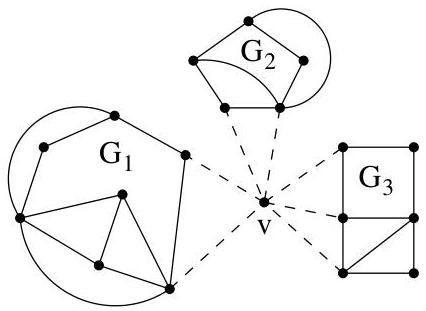

III.4. Théorème de Kuratowski

Lemma III.4.4. Soit  $G = (V, E)$  a graph non planaire ne satisfaisant pas (K) et pour lequel  $\# E$  est minimal pour ces propriétés. Alors  $G$  est 3-connexe.

Pour rappel, l'opération de contraction a été donnée à la définition II.5.3.

Lemma III.4.5. Soit  $G = (V, E)$  un graphe 3-connexe ayant au moins 5 sommets. Il existe une arête  $e \in E$  telle que la contraction  $G \cdot e$  soit encore 3-connexe.

Lemma III.4.6. Soit  $G = (V, E)$  un graphe. Si pour une arête  $e \in E$ ,  $G \cdot e$  satisfait (K), alors  $G$  aussi.

Lemma III.4.7. Tout graphe 3-connexe et qui ne satisfait pas (K) est planaire.

Démonstration. (Théorème de Kuratowski) Au vu deslemmes III.4.1 et III.4.2, il est clair que si  $G$  satisfait (K), alors  $G$  n'est pas planaire.

Il suffit donc de vérifier que si  $G$  n'est pas planaire, alors  $G$  satisfait (K). Procedons par l'absurde et supposons que  $G$  est non planaire et satisfait (K). Quitte à replacer  $G$  par un graphe qui lui est homéomorphe (cela ne change en rien la (non-)planarité), on peut supposer que  $G$  contient un nombre minimal d'arêtes. Ainsi, par le lemme III.4.4,  $G$  est 3-connexe. Du lemme III.4.7, on tire que  $G$  est planaire. Ceci achève la preuve.

Démonstration. (Lemme III.4.4) Montrons d'abord que  $G$  est 2-connexe en procédant par l'absurde et en supposant que  $G$  possède un point d'articulation  $v$ . Soient  $A_{1},\ldots ,A_{k}$  les composantes connexes de  $G - v$ ,  $k\geq 2$ . Pour tout  $i$ , le sous-graphe  $G_{i}$  de  $G$  induit par les sommets de  $A_{i}$  et  $v$  possède un nombre d'arêtes strictement inférieur au nombre d'arêtes de  $G$ . Par hypothèse,  $G$  est un grahe non planaire ne satisfaisant pas  $(\mathbf{K})$  et ayant un nombre minimal d'arêtes pour ces propriétés. On en conclus que  $G_{i}$  est planaire et par la proposition III.1.6, on peut même supposer que  $v$  se trouve sur la frontière extérieure de  $G_{i}$ . De là, on en conclus que  $G$  est

FIGURE III.9. Si  $G$  n'était pas 2-connexe.