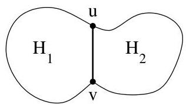

Chapitre III. Graphes planaires

planaire, une contradiction.

Supposons à présent que  $G$  possède un ensemble d'articulation formé de deux sommets:  $S = \{u, v\}$ . (On ne peut pas faire moins car  $G$  est au moins 2-connexe, vu la première partie de la preuve). Soient  $G_{1} = (E_{1}, V_{1})$  et  $G_{2} = (E_{2}, V_{2})$  deux sous-graphes de  $G$  tels que  $E = E_{1} \cup E_{2}$ ,  $V_{1} \cap V_{2} = S$  et contenant chacun une composante connexe de  $G - S$ . Il existe dans  $G_{1}$  (resp. dans  $G_{2}$ ) un chemin joignant  $u$  et  $v$  (car  $u$  comme  $v$  sont adjacents à un sommet de chaque composante connexe de  $G - S$ ).

On utilise le même raisonnement que précédemment. Soit  $H_{i}$  le sous-graphe de  $G$  induit par les sommets de  $G_{i}$  et de  $S$ ,  $i = 1,2$ , auquel on ajoute éventuellement l'arête  $\{u,v\}$  (cette arête peut ou non apparénir à  $E$ ). Si  $H_{1}$  et  $H_{2}$  étaient tous les deux planaires, on pourrait en conclude que  $G$  lui-même est planaire en plaçant l'arête  $\{u,v\}$  à sur la frontière extérieure de  $H_{1}$  et  $H_{2}$  (ce qui est possible vu la proposition III.1.6).

FIGURE III.10.  $H_{1}$ ,  $H_{2}$  et l'arête  $\{u, v\}$ .

Ainsi, supposons que  $H_{1}$  est non planaire. Puisqu'il contient moins d'arêtes que  $G$ , alors  $H_{1}$  satisfait (K). Cependant, il nous faut encore retirer l'arête  $\{u,v\}$  si cette dernière n'appartient pas à  $G$ . Néanmoins,  $G$  va lui aussi satisfaire (K) car on dispose d'un chemin dans  $G_{2}$  joignant  $u$  et  $v$ . On peut donc substituer ce chemin à  $\{u,v\}$  et assurer que  $G$  satisfait (K) sans utiliser l'arête  $\{u,v\}$ . On a donc obtenu une contradiction et  $G$  ne peut contenir un ensemble d'articulation contenant uniquement 2 sommets.

Démonstration. (Lemme III.4.5) Procedons par l'absurde et supposons que, qu'elle que soit l'arête  $e \in E$ , le graphe  $G \cdot e$  possède un ensemble de coupure  $S$  tel que  $\# S = 2$  (on suppose donc que  $G \cdot e$  n'est plus 3-connexe). Soient  $e = \{u, v\}$  et  $x$  le sommet obtenu après contraction de  $e$ . Ce sommet  $x$  appartient à  $S$  car sinon,  $G$  lui-même possèderait  $S$  comme ensemble de coupure (or, par hypothèse  $G$  est 3-connexe). Ainsi, on a  $S = \{x, z\}$  pour un certain sommet  $z$ . On peut en conclude que

$$
T = \{u, v, z \}
$$

est un ensemble de coupure de  $G$ . Puisqu'un tel ensemble existe, on désisit  $^7 e$  et  $z$  de manière telle que  $G - T$  possède une composante connexe  $A$  contenant un nombre minimal de sommets.