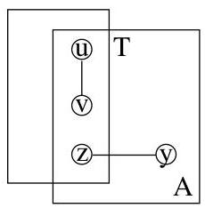
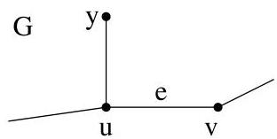
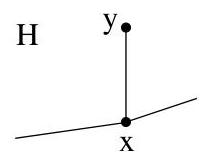

III.4. Théorème de Kuratowski

Il existe dans  $A$  un sommet  $y$  tel que  $\{y, z\}$  est une arête de  $E$  car sinon,  $\{u, v\}$  séparerait  $A$  du reste du graphe  $G$  (ce qui n'est pas possible car  $G$  est 3-connexe). Si on contracte l'arête  $\{y, z\}$  dans le graphe  $G$ , au vu de notre

FIGURE III.11. Lemme III.4.5

supposition, le graphe  $G \cdot \{y, z\}$  n'est pas 3-connexe. On applique donc à nouveau le même raisonnement et on en tire qu'il existe un sommet  $w$  tel que

$$
R = \{y, z, w \}
$$

sépare  $G$  ( $w$  peut très bien être égal à  $u$  ou a  $v$ , ce n'est pas interdit).

Si on regarde le graphe  $G - R$ , il possède une composante connexe  $B$  ne contenant ni  $u$  ni  $v$ . En effet,  $\{u, v\}$  est une arête de  $G$  (donc soit les deux sommets appartiennent à une même composante distincte de  $B$ , soit, lorsque  $w = u$  ou  $w = v$ , un de ces deux sommets est supprimé et l'autre appartient à une composante distincte de  $B$ ). Cette composante connexe  $B$  contient un sommet  $y'$  tel que  $\{y, y'\} \in E$ . C'est le même raisonnement que précédemment, si ce n'était pas le cas, alors  $\{z, w\}$  séparerait  $G$ .

Le sous-graphe de  $G - T$  induit par les sommets de  $B$  est connexe. Puisque  $y \in A$ ,  $y' \in B$  et  $\{y, y'\} \in E$ , on en conclus que  $B$  est inclus dans  $A$  et cette inclusion est propre car  $y$  n'appartient pas à  $B$ . De là  $\# B &lt; \# A$  et on obtient une contradiction, vu le choix de  $A$ .

Démonstration. (Lemme III.4.6) Soit  $H$ , un sous-graphe de  $G \cdot e$  homéomorphe à  $K_{5}$  ou  $K_{3,3}$  dont  $x$  est un sommet. On suppose de plus que ce sommet  $x$  de  $G \cdot e$  est obtenu par contraction de  $e = \{u, v\}$ . Si  $x$  est de degré 2, alors il est immédiat que  $G$  possède la propriété (K). Il reste à envisager les cas  $\deg(x) = 3$  et  $\deg(x) = 4$  (car  $K_{3,3}$  est 3-régulier et  $K_{5}$  est 4-régulier). S'il existe au plus une arête  $\{x, y\}$  dans  $H$  telle que  $\{u, y\}$  ou  $\{v, y\}$  appartiennent à  $E$  (ou exclusif), alors il est clair que  $G$  satisfait (K).

FIGURE III.12. Si on dispose d'au plus une arête.

