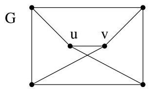
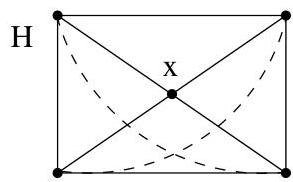
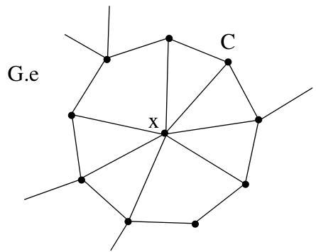
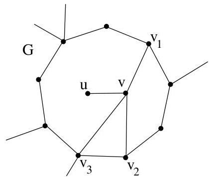

Chapitre III. Graphes planaires

Il reste donc le cas où à la fois  $u$  et  $v$  ont 3 voisins dans le sous-graphe de  $G$  correspondant à  $H$ . En particulier,  $H$  est donc homéomorphe à  $K_{5}$ . Grâce à la figure III.13, on se convainc que  $G$  contient un sous-graphe homéomorphe à  $K_{3,3}$ .

FIGURE III.13.  $G$  contient un sous-graphe homéomorphe à  $K_{3,3}$ .

Démonstration. (Lemme III.4.7) On procède par récurrence sur  $\# V$ . Le seul graphe 3-connexe à 4 sommets est  $K_{4}$  et il est planaire. On peut donc supposer  $\# V \geq 5$ . Par le lemme III.4.5, il existe une arête  $e = \{u, v\}$  telle que  $G \cdot e$  (ou l'arête contractée donne le sommet  $x$ ) est 3-connexe. Par le lemme III.4.6, puisque  $G$  ne vérifie pas  $(\mathbf{K})$ , il en est de même pour  $G \cdot e$ . Puisque  $G \cdot e$  possède un sommet de moins que  $G$ , on peut appliquer l'hypothèse de récurrence et en conclude que  $G \cdot e$  est planaire.

Considérons une représentation planaire de  $G \cdot e$  et  $C$  la frontière de la face de  $(G \cdot e) - x$  qui contiendrait  $x$ . Puisque  $G$  est 3-connexe,  $C$  est un cycle.

Il est clair que  $G - \{u, v\} = (G \cdot e) - x$ . Par conséquent,  $\nu_{G}(u) \subset C \cup \{v\}$  et  $\nu_{G}(v) \subset C \cup \{u\}$  (ou l'on a identifié le cycle  $C$  et l'ensemble de ses sommets). Supposons que, dans  $G$ ,  $\deg(v) \leq \deg(u)$  (on pourrait par symétrie traiter l'autre situation). Ordonnons les sommets de  $\nu_{G}(v) \setminus \{u\} = \{v_{1}, \ldots, v_{k}\}$  en respectant le cycle  $C$ . Soit  $P_{i,j}$  le chemin le long de  $C$  joignant  $v_{i}$  à  $v_{j}$  par indices croissants. En se basant sur la représentation planaire de  $G - \{u, v\}$ , on obtient une représentation planaire de  $G - u$  en traçant les segments de droites  $\{v, v_{i}\}$ .

FIGURE III.14. Illustration du lemme III.4.7.

