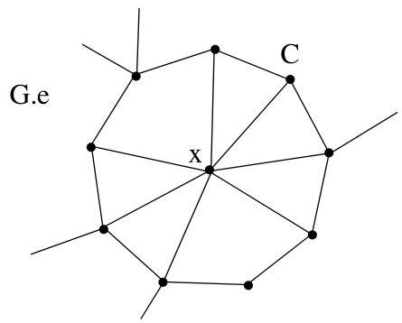
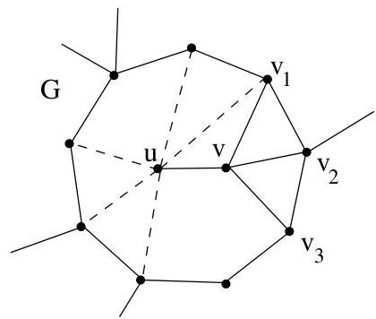
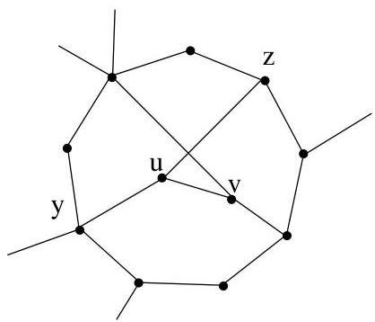
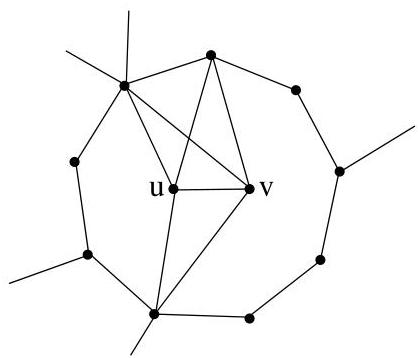

III.4. Théorème de Kuratowski

(a) Si  $\nu_{G}(u)\setminus \{v\} \subseteq P_{i,i + 1}$  (ou  $i + 1$  est interprete modulo  $k$  ) pour un certain  $i$  , alors  $G$  est planaire. Il suffit de positionner  $u$  dans le triangle  $v,v_{i},v_{i + 1}$

FIGURE III.15. Illustration du lemme III.4.7, cas (a).

(b) S'il existe  $y, z \in \nu_{G}(u) \setminus \{u\}$  tels que  $y \in P_{i,j}$  et  $z \notin P_{i,j}$  avec  $y, z \notin \{v_i, v_j\}$ . Dans ce cas,  $\{u, v_i, v_{i+1}\}$  et  $\{v, z, y\}$  forment une copie homéomorphe à  $K_{3,3}$ , ce qui est impossible.
(c) Le dernier cas à envisager est donc  $\nu_{G}(u)\setminus \{v\} \subset \nu_{G}(v)$ . Or nous avons supposer que  $\deg (v)\leq \deg (u)$ , de là,

$\nu_{G}(u)\setminus \{v\} = \nu_{G}(v)\setminus \{v\}$  et  $\deg (u) = \deg (v)$

Si  $\deg (u) = \deg (v)\leq 3$  , le graphe  $G$  est planaire. Sinon, il contient une copie homéomorphe a  $K_{5}$

FIGURE III.16. Illustration du lemme III.4.7, cas (b) et (c).

