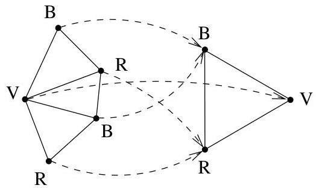

# CHAPITRE IV

# Coloriage

Dans ce chapitre, on considère le problème de coloriage de sommets d'un graphe, le théorème des cinq couleurs et une introduction à la théorie de Ramsey. Nous supposerons rencontres des multi-graphes non orientés (les boucles n'ont ici que peu d'importance).

# 1. Nombre chromatique

Definition IV.1.1. Soit  $c: V \to \Sigma$  un étiquetage des sommets du graphe où l'on suppose que  $\Sigma$  est fini. Dans le contexte qui nous intéresse, on parlera plutôt de coloriage et pour tout sommet  $u$ , on dira que  $c(u)$  est la couleur de  $u$ . Un coloriage  $c$  des sommets d'un graphe est dit propre si deux sommets voisins ont des couleurs distinctes pour  $c$ .

S'il existe un coloriage propre  $c: V \to \Sigma$  de  $G$  tel que  $\# \Sigma = k$ , on dira que  $G$  est  $k$ -colorable. La valeur minimum de  $k$  pour laquelle  $G$  est  $k$ -colorable est appelée le nombre chromatique de  $G$  et est noté  $\chi(G)$ .

Remarque IV.1.2. Pour obtenir un coloriage propre, on peut attribuer à des sommets indépendants (définition I.5.1) une même couleur. Ainsi, le nombre chromatique d'un graphe  $G = (V, E)$  est le nombre minimum de sous-ensembles de sommets indépendants nécessaires pour partitionner  $V$ .

Lemma IV.1.3. Le nombre chromatique d'un graphe  $G = (V, E)$  (non orienté et simple) est le plus petit entier n tel qu'il existe un homomorphisme de  $G$  dans  $K_{n}$ .

FIGURE IV.1. Une illustration du lemme IV.1.3.

Démonstration. Soient  $H = (V', E')$  un graphe simple et  $f: V \to V'$  un homomorphisme de graphes. Pour tout  $y \in V'$ ,

$$
f ^ {- 1} (y) = \{x \in V: f (x) = y \}.
$$