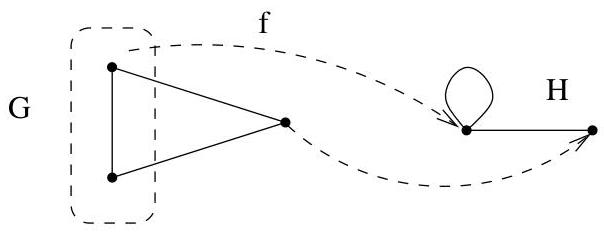

Chapitre IV. Coloriage

Puisque  $H$  est simple, il ne contient aucune boucle et donc,  $f^{-1}(y)$  est formé de sommets indépendants (cf. définition I.5.1).

FIGURE IV.2. Si  $H$  n'est pas simple.

Par conséquent, s'il existe un homomorphisme de  $G$  vers un graphe simple à  $n$  sommets ( comme  $K_{n}$  par exemple), alors  $G$  est  $n$ -colorable  $(\chi(G) \leq n)$ . Réciproquement, si  $G$  est  $n$ -colorable, alors l'application qui envoie les sommets de  $G$  d'une même couleur sur un sommet de  $K_{n}$  est un homomorphisme.

Proposition IV.1.4. Un graphe  $G = (V, E)$  est bipartis si et seulement si il est 2-colorable.

Demonstration. C'est immédiat.

Remarque IV.1.5. Un graphe  $G = (V, E)$  est 1-colorable si et seulement si  $E = \emptyset$ .

# 2. Le théorème des cinq couleurs

On peut reprendre le problème de cartographie énoncé à l'exemple I.3.4. Tout d'abord, on peut remarquer que par projection stéréographique, tout problème de planarité ou de coloriage de graphes sur la sphère revient à un problème analogue dans le plan.

Le lecteur attentif aura remarqué que le problème de cartographie demande de colorier des faces adjacentes d'un graphe planaire avec des couleurs distinctes. Pourtant, dans la section précédente, nous nous sommes intéressés au coloriage des sommets d'un graphe. On pourrait donc penser qu'il s'agit d'un nouveau type de problème. En fait, il n'en est rien comme nous allons le voir en introduisant le dual d'un graphe planaire.

Définition IV.2.1. Soit  $G = (V, E)$  un multi-graphe planaire. Le dual  $G^*$  de  $G$  est le graphe dont les sommets sont les faces de  $G$ . A chaque arête de  $G$  appartenant à la frontière de deux faces  $F$  et  $F'$ , il correspond une arête dans  $G^*$  joignant les sommets correspondants aux faces  $F$  et  $F'$ . Il est clair que le dual d'un graphe planaire est encore planaire et que  $(G^*)^* = G$ .