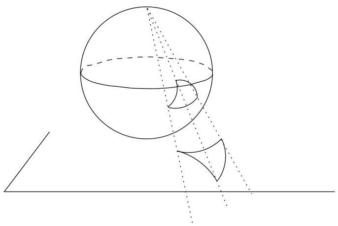
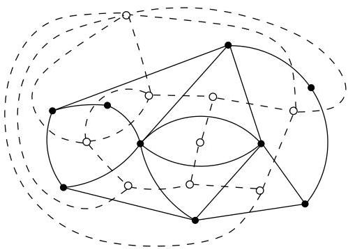

IV.2. Le théorème des cinq couleurs

FIGURE IV.3. Projection stéréographique.

FIGURE IV.4. Un graphe et son dual.

Ainsi grâce au dual, colorier les faces d'un graphe planaire, revient à colorier les sommets de son dual et inversement.

Remarque IV.2.2. La trace la plus ancienne du "problème des quatre couleurs" remonte à une lettre de De Morgan datée du 23 octobre 1852 et destinée à Hamilton: "A student of mine asked me today to give him reason for a fact which I did not know was a fact and do not yet. He says that if a figure be anyhow divided and the compartments differently colored, so that figures with any portion of common boundary line are differently coloured — four colours may be wanted but no more." L'étudiant dont il est question dans la lettre est Frederick Guthrie. Futur physicien, il avait pris connaissance de ce problème par son frère Francis, futur mathématicien, qui avait fait cette conjecture en observant la carte d'Angleterre. Un résumé interressant de l'histoire du théorème des quatre couleurs peut être trouve dans "Four Colours Suffice, or how to colour a map, R. Wilson, European Math. Society Newsletter 46 December 2002, 15-19."