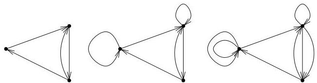
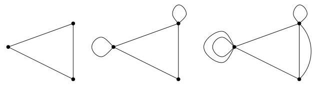
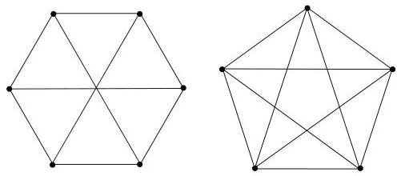

I.2. Graphes non orientés

C'est immédiat. (Et on comprend mistrés la double contribution des boucles pour le degré d'un sommet...)

L'exemple suivant illustré les différentes classes de graphes rencontres jusqu'à présent. Bien sur, tout graphe simple est un graphe et tout graphe est un multi-graphe.

Exemple I.2.4. A la figure I.5, on a représenté, dans le cas dirigé, un graphe simple, un graphe et enfin, un multi-graphe. La figure I.6 reprend

FIGURE I.5. Un graphe (dirigé) simple, un graphe et un multi-graphe.

les mêmes éléments dans le cas non orienté.

FIGURE I.6. Un graphe (non dirigé) simple, un graphe et un multi-graphe.

Definition I.2.5. Soit  $k \geq 1$ . Un multi-graphe orienté (resp. non orienté)  $G = (V, E)$  est  $k$ -régulier si pour tout  $v \in V$ ,  $d^{+}(v) = k$  (resp.  $\deg(v) = k$ ). Le graphe de gauche (resp. de droite) de la figure I.7 est 3-régulier (resp. 4-régulier). Le graphe de droite de la figure I.7 est en particulier simple et

FIGURE I.7. Des graphes non orientés 3 et 4-réguliers.

complet. Un graphe  $G = (V, E)$  est complet si  $E = V \times V$ , plus exactement, on suppose souvent que

$$
E = V \times V \setminus \{(v, v) \mid v \in V \}
$$

(autrement dit, on ne tient pas compte des boucles). En particulier, un graphe complet est symétrique. On note  $K_{n}$  le graphe simple non orienté