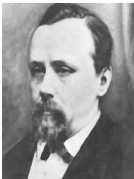

Chapitre IV. Coloriage

FIGURE IV.5. Francis Guthrie.

Dans la suite, nous nous intéressons donc au coloriage des faces d'un multi-graphe planaire de manière telle que deux faces adjacentes (y compris la face infinie) recoivent des couleurs distinctes. On parlera alors simplement de coloriage, les contraintes précitées étant sous-entendues.

Par convention, les couleurs seront désignées par des lettres grecques minuscules. Il est tout d'abord clair qu'il existe des graphes pour lesquels quatre couleurs sont nécessaires. Il suffit de considérer le graphe de la figure III.4.

Nous allons ici démontré une version plus faible que le véritable théorème des quatre couleurs. Notre presentation est basée sur celle d'Ore [20]. En effet, nous allons démontré le théorème suivant. Ce résultat contient les idées essentielles du théorème des quatre couleurs et présente l'avantage de pouvoir être démontré de manière directe.

Théorème IV.2.3. Cinq couleurs suffisent pour colorier les faces d'un multi-graphe planaire de manière telle que deux faces adjacentes recoivent des couleurs distinctes.

Pour démontré ce résultat, on peut tout d'abord se restreindre à des multi-graphes 3-réguliers. Tout d'abord, les sommets de degré 1 peuvent être éliminés. Ils n'interviennent pas dans la définition d'une face. Ensuite, on peut modifier le graphe comme à la figure IV.6 pour ne plus avoir de sommets de degré 2. Il est clair que cette opération ne modifie en rien un

FIGURE IV.6. Suppression des sommets de degré 2.

coloriage valide. Ainsi, le graphe résultat possède un coloriage valide si et seulement si le graphe de départ en possède un.

Nous pouvons enfin modifier le graphe comme à la figure IV.7 pour ne plus avoir de sommets de degré  $\geq 4$ . Si le graphe résultat possède un coloriage valide avec le graphe de départ aussi.