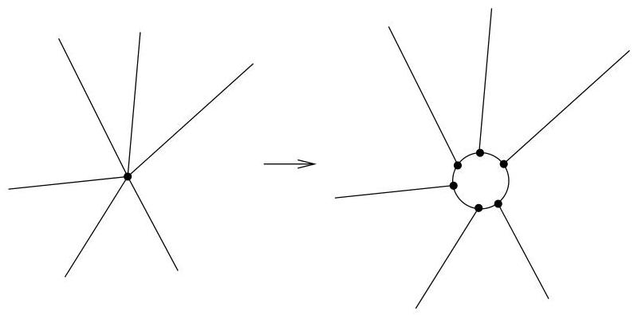

IV.2. Le théorème des cinq couleurs

FIGURE IV.7. Suppression des sommets de degré  $\geq 4$ .

Ainsi, nous pouvons considérer avoir un graphe planaire 3-régulier  $G$ . Si nous sommes capables de colorier les graphes planaires 3-réguliers, nous serons capables de colorier n'importe quel graphe planaire. Denotons par  $\varphi_{i}$ , le nombre de faces de  $G$  dont la frontière est déterminée par exactement  $i$  arêtes (ou de manière équivalente, par  $i$  sommets),  $i \geq 2$ . Le graphe étant 3-régulier, chaque sommet appartient à 3 faces. Si pour chaque face, nous en comptons les sommets², on obtient

Notations de la formule d'Euler.

$3s = 2\varphi_{2} + 3\varphi_{3} + 4\varphi_{4} + 5\varphi_{5} + \dots$

Si pour chaque face, nous en comptons les arêtes³, on obtient

$2a = 2\varphi_{2} + 3\varphi_{3} + 4\varphi_{4} + 5\varphi_{5} + \dots$

Enfin, il est clair que

$f = \varphi_{2} + \varphi_{3} + \varphi_{4} + \varphi_{5} + \dots$

Si on substitue les termes apparaissant dans la formule d'Euler  $12 = 6s - 6a + 6f$  par les valeurs obtenues ci-dessus, on obtient la relation

$12 = 4\varphi_{2} + 3\varphi_{3} + 2\varphi_{4} + \varphi_{5} - \varphi_{7} - 2\varphi_{8} - \dots$

Or les  $\varphi_{i}$  sont positifs ou nuls. Dès lors, on en tire le résultat suivant.

Lemme IV.2.4. Tout multi-graphe planaire 3-régulier contient une face dont la frontière est délimitée par 2,3,4 ou 5 arêtes.

Notre but est de considérer, dans le graphe  $G$ , une face délimitée par 2,3,4 ou 5 arêtes et d'en supprimer une arête. (L'existence d'une telle face est assurée par le lemme IV.2.4.) De cette façon, on obtient un graphe  $G'$  ayant au moins une face de moins que le graphe  $G$  de départ. Les constructions que nous allons développer auront deux propriétés.