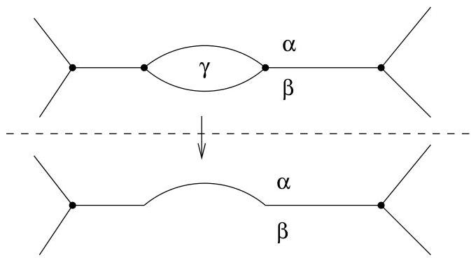

Chapitre IV. Coloriage

R.1 La construction préserve le caractère 3-régulier (on pourra donc l'appliquer itérativement).
R.2 Si le graphe  $G'$  peut être colorié avec au plus 5 couleurs, alors il en est de même pour le graphe de départ  $G$ .

On parle en général de réduction. On s'est ramené à un problème pour un graphe ayant moins de faces que le graphe initial.

Ainsi, grâce à la propriété R.1, chaque étape fournit un graphe 3-régulier. Au vu du lemme IV.2.4, on peut opérer une nouvelle réduction et diminuer le nombre de faces du graphe. En répétant la procédure, on obtiendra un graphe ayant au plus 5 faces qu'il est donc toujours possible de colorier! La propriété R.2 assure alors que le graphe de départ peut, lui aussi, être correctement colorié.

- Réduction d'une face délimitée par deux arêtes

Considérons la situation donnée à la figure IV.8 et sa réduction. Il est facile

FIGURE IV.8. Réduction d'une face délimitée par deux arêtes.

de se convaincre que les propriétés R.1 et R.2 sont satisfaites.

- Réduction d'une face délimitée par trois arêtes

Considérons la situation donnée à la figure IV.9 et sa réduction. Il est facile de se convaincre que les propriétés R.1 et R.2 sont satisfaites.

- Réduction d'une face délimitée par quatre arêtes

Ici, la situation est un peu plus délicate. Si une face  $F$  est délimitée par quatre arêtes, comme on le voit à la figure IV.10, quatre faces  $A, B, C, D$  peuvent lui être adjacentes. Dans le premier cas,  $A$  et  $C$  ne sont pas adjacentes, dans le deuxième cas (gardez à l'esprit que le graphe doit être 3-régulier), elles ont une arête commune. Mais dans tous les cas,  $B$  et  $D$  ne font pas partie d'une même face et ne sont pas adjacents (ils pourront donc receivevoir la même couleur). Enfin, dans le dernier cas,  $A$  et  $C$  constituent une seule face. Il faut se convaincre qu'il s'agit des seules situations envisageables (quitte à renommer les différentes faces). En effet, il n'est pas possible dans le plan que simultanément, les faces  $A$  et  $C$  soient adjacentes de même que  $B$  et  $D$ . On peut supprimer certains sommets et arêtes pour