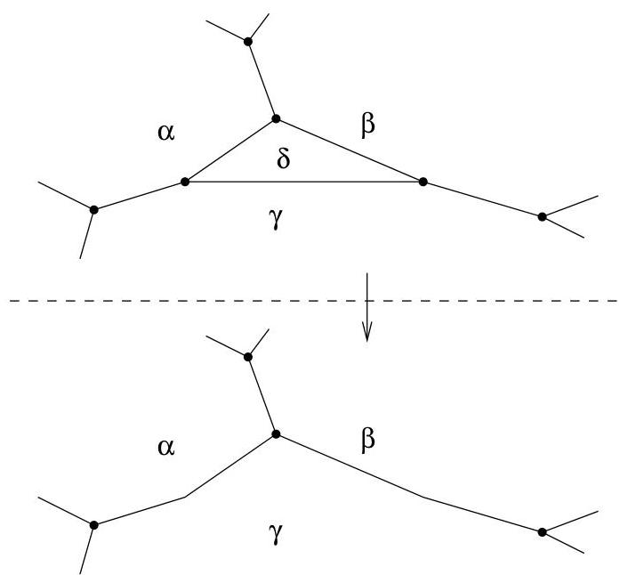
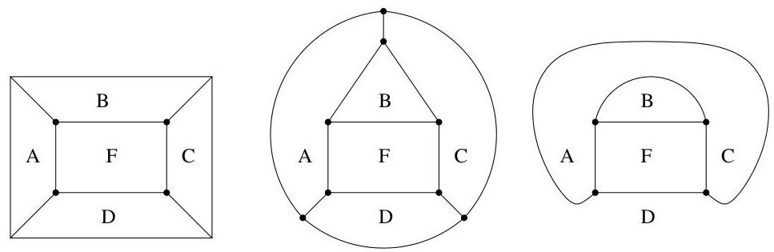
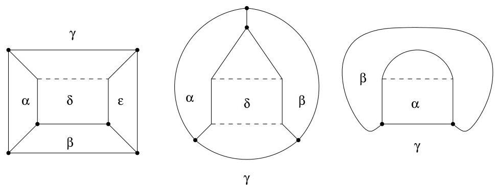

IV.2. Le théorème des cinq couleurs

FIGURE IV.9. Réduction d'une face délimitée par deux arêtes.

FIGURE IV.10. Configurations pour la réduction d'une face rectangulaire.

obtenir les configurations de la figure IV.11. Ces dernières peuvent être coloriées et la propriété R.1 est bien satisfaite. Ensuite, il reste à se convaincre,

FIGURE IV.11. Réductions d'une face rectangulaire.