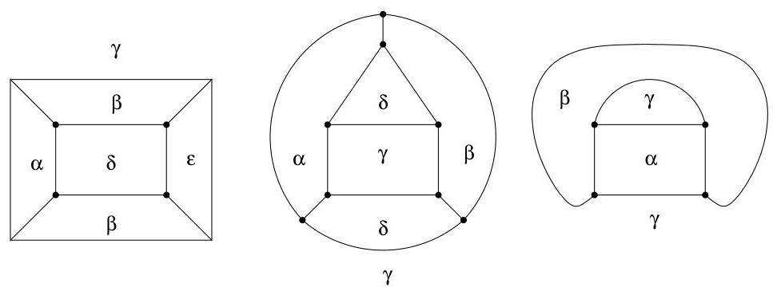
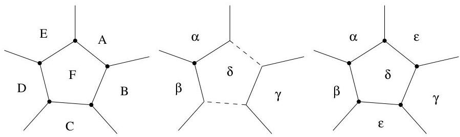

Chapitre IV. Coloriage

grace à la figure IV.12 que R.2 est aussi satisfait.

FIGURE IV.12. Satisfaction de R.2.

# - Réduction d'une face délimitée par cinq arêtes

Le raisonnement est semblable au cas précédent. Il existe toujours deux faces opposées, disons  $A$  et  $C$ , adjacentes à une face pentagonale  $F$  telles que  $A$  et  $C$  ne font pas partie d'une même face et ne sont pas adjacentes. On modifie le graphe comme indiqué à la figure IV.13. Les faces  $B$ ,  $D$  et  $E$  peuvent nécessiter 3 couleurs distinctes  $\alpha$ ,  $\beta$  et  $\gamma$ . Ayant 5 couleurs à notre disposition, il est possible d'assurer R.2. Cela ne serait pas le cas avec uniquement 4 couleurs. Ceci démontre entièrement le théorème des cinq

FIGURE IV.13. Réductions d'une face pentagonale.

couleurs. Comme le montre la figure IV.14, dans le cas de face pentagonale, l'utilisation de 5 couleurs est inévitable (en utilisant la méthode préconisée ci-dessus, à savoir donné la même couleur aux deux faces non adjacentes). Bien sur, il est possible de réaliser un coloriage ne nécessitant pour cela que 4 couleurs, mais des lors, on sort de la méthode de réduction proposée.

Enonçons enfin le théorème des quatre couleurs. La démonstration de ce dernier nécessite le même type de réductions que celles effectuées pour le théorème des cinq couleurs mais ici, le nombre de configurations à considérer est de l'ordre de 600 pour la preuve fournie par N. Robertson, D. Sanders, P. Seymour et R. Thomas (1996). La preuve originale de K. Appel et W. Haken utilisait quant à elle pres de 2000 configurations inévitables. Par ailleurs, cette dernière preuve a en fait été partiellement réalisée par un