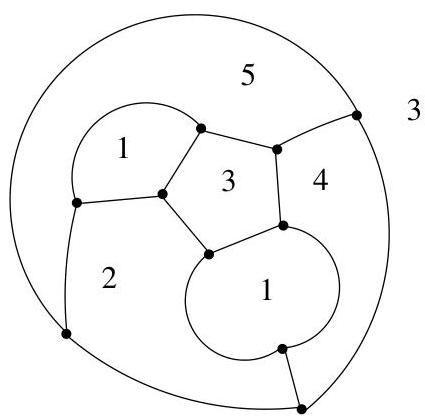
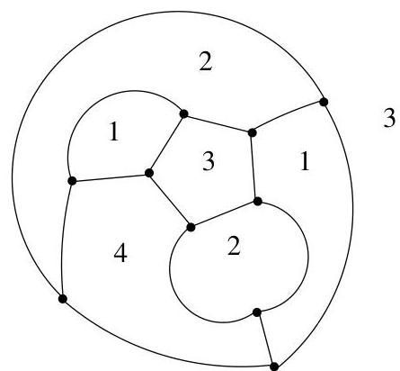
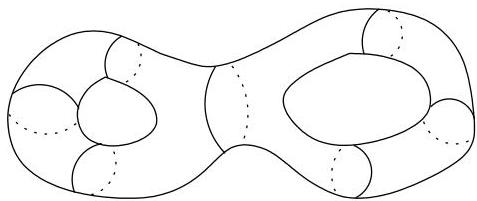

IV.2. Le théorème des cinq couleurs

FIGURE IV.14. Cinq couleurs effectives.

programme informatique $^4$  passant en revue et testant l'ensemble de ces configurations.

Théorème IV.2.5 (K. Appel, W. Haken (1976)). Quatre couleurs suffisent pour colorier les faces d'un multi-graphe planaire de manière telle que deux faces adjacentes recoivent des couleurs distinctes.

Remarque IV.2.6. On pourrait s'intéresser à des questions de coloriage (ou de planarité) pour des graphes tracés sur d'autres surfaces que la sphère ou le plan. On dispose par exemple du théorème des sept couleurs : Sept couleurs sont suffisantes pour colorier tout multi-graphe planaire sur un tore. De plus, il existe un multi-graphe planaire sur un tore nécessitant sept couleurs.

Remarque IV.2.7. Le genre d'une surface est un invariant topologique. Il s'agit du nombre maximum de courbes simples fermées que l'on peut tracer sur la surface sans la disconnector. De manière grossière, cela correspond

FIGURE IV.15. Une surface de genre 2.

au nombre de “trous” que la surface comporte. Ainsi, le genre d'une sphère vaut 0 et celui d'un tore vaut 1. On dispose de la formule d'Heawood (1980) qui stipule que si un graphe peut être représenté de manière planaire sur