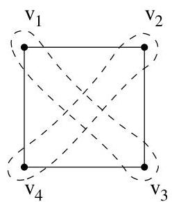
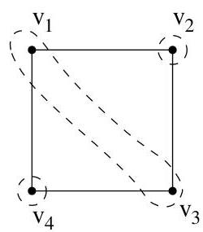
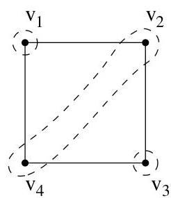

IV.3. Polynôme chromatique

FIGURE IV.16. Illustration de  $m_{k,G}$ .

titions de  $V$  en  $k$  sous-ensembles (disjoints et non vides) donnant lieu à tous les coloriages propres possibles de  $G$  utilisant exactement  $k$  couleurs,  $k = 2,3$ . Pour  $k = 2$ , on a la partition  $V = \{v_{1}, v_{3}\} \cup \{v_{2}, v_{4}\}$  et les coloriages  $c_{1}: v_{1}, v_{3} \mapsto 1$ ,  $v_{2}, v_{4} \mapsto 2$  et  $c_{2}: v_{1}, v_{3} \mapsto 2$ ,  $v_{2}, v_{4} \mapsto 1$ . Ainsi,  $m_{2,G} = 2$  et  $m_{2,G}/2! = 1$  correspond bien à la seule partition convenable de  $V$ . Pour  $k = 3$ , on a deux partitions possibles de  $V$  en  $\{v_{1}, v_{3}\} \cup \{v_{2}\} \cup \{v_{4}\}$  ou bien  $\{v_{1}\} \cup \{v_{3}\} \cup \{v_{2}, v_{4}\}$ . Chaque partition donne lieu à 3! coloriages propres distincts de  $G$ . Ainsi,  $m_{3,G} = 12$  et  $m_{3,G}/3! = 2$ . Pour  $k = 4$ , il y a une seule partition de  $V$  en quatre singletons donc  $m_{4,G}/4! = 1$ . Par conséquent, le polynôme chromatique du graphe est donné par

$$
\underbrace {m _ {1 , G}} _ {= 0} z + \underbrace {\frac {m _ {2 , G}}{2 !}} _ {= 1} z (z - 1) + \underbrace {\frac {m _ {3 , G}}{3 !}} _ {= 2} z (z - 1) (z - 2) + \underbrace {\frac {m _ {4 , G}}{4 !}} _ {= 1} z (z - 1) (z - 2) (z - 3)
$$

ou encore

$$
\pi_ {G} (z) = z ^ {4} - 4 z ^ {3} + 6 z ^ {2} - 3 z.
$$

Exemple IV.3.4. Pour le graphe complet  $K_{n}$ , les seuls ensembles de sommets indépendants sont les singletons. Ainsi, pour tout  $k &lt; n$

$$
\frac {m _ {k , K _ {n}}}{k !} = 0 \quad \text {e t} \quad \pi_ {K _ {n}} (z) = z ^ {\underline {{n}}}.
$$

Remarque IV.3.5. Quelques remarques immédiates.

- Si  $G$  possède  $n$  sommets, alors  $m_{n,G} = n!$  car on assigne une couleur par sommet. On en déduit que le polynôme chromatique est monique.
Si  $G$  n'est pas connexe mais possede 2 composantes  $G_{1}$  et  $G_{2}$ , alors

$$
\pi_ {G} (z) = \pi_ {G _ {1}} (z). \pi_ {G _ {2}} (z).
$$

Cela résultat du fait que les sommets de  $G_{1}$  peuvent être colorés indépendamment de ceux de  $G_{2}$ .

- Il est clair que  $\pi_G(0) = 0$  pour tout graphe  $G$ .
- Il est impossible de colorier un graphe non vide avec aucune couleur.

Proposition IV.3.6. Soit  $k \in \mathbb{N}$ . Le nombre  $\pi_G(k)$  est le nombre de coloriages propres de  $G$  utilisant au plus  $k$  couleurs.