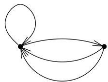
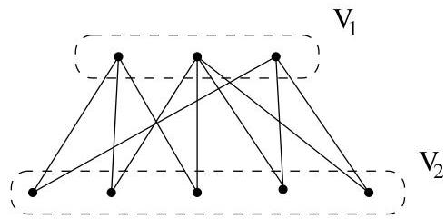

Chapitre I. Premier contact avec les graphes

FIGURE I.8. Un multi-graphe orienté 2-régulier.

complet à  $n$  sommets. Ainsi, la figure I.7 représenté le graphe  $K_{5}$ . Dans ce cours, lorsqu'on parlera de graphes complets, il sera sous-entendu qu'il s'agit de graphes simples et non orientés.

Definition I.2.6. Un graphe  $G = (V, E)$  est dit biparti si  $V$  peut être partitionné en deux ensembles  $V_{1}$  et  $V_{2}$  de manière telle que  $E \subseteq V_{1} \times V_{2}$ . Si  $\# V_{1} = m$ ,  $\# V_{2} = n$  et  $E = V_{1} \times V_{2}$ , alors on parle du graphe biparti

FIGURE I.9. Un graphe biparti (non complet).

complet et il est noté  $K_{m,n}$ . On peut généraliser cette notion et définir des graphes  $n$ -partis, pour  $n \geq 2$ . Pour ce faire,  $V$  doit être partitionné en  $n$  sous-ensembles  $V_{1}, \ldots, V_{n}$  de manière telle que

$$
E \subseteq \bigcup_ {i \neq j} V _ {i} \times V _ {j}.
$$

Definition I.2.7. Un multi-graphe  $G = (V, E)$  (orienté ou non) est étiqueté (par  $f$ ) s'il existe une fonction

$$
f: E \to \Sigma
$$

où  $\Sigma$  est un ensemble quelconque. Si  $\Sigma \subseteq \mathbb{R}^{+} = [0, +\infty[$ , on parle souvent de multi-graphe pondéré et on dit que  $f$  est une fonction de poids. Un étiquetage peut par exemple servir à préciser des coûts (coût de transport, des distances, des couleurs, etc...). Si  $a$  est un arc,  $f(a)$  est l'étiquette, le label ou encore le poids de  $a$ . On peut de la même manière définir un étiquetage des sommets au moyen d'une fonction  $g: V \to \Sigma$ .

Example I.2.8. Le graphe de la figure I.10 représenté quelques villes belges connectées par un réseau autoroutier. L'étiquette de chaque arête représenté la distance, par autoroute, entre les deux extrémités de celle-ci. Nous avons choisi un graphe non orienté car les autoroutes belges sont toujours dans les deux sens.