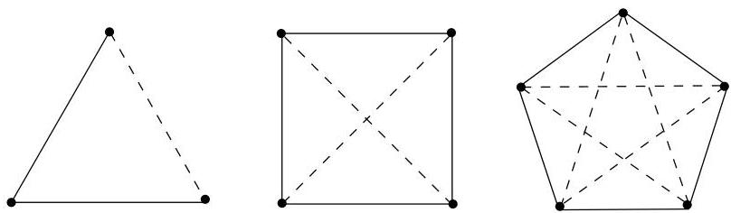

Chapitre IV. Coloriage

En fait, nous allons définir le nombre  $R(s,t)$  comme étant le plus petit  $n$  tel que  $K_{n}$  contienne une copie de  $K_{s}$  rouge ou une copie de  $K_{t}$  bleue. Il nous faudra bien sur montrer que ces nombres existent (cf. théorème IV.4.3). Mais si de tels nombres existent, par définition même de  $R(s,t)$ , on peut énoncer le résultat suivant.

Théorème IV.4.1 (Ramsey (1930)). Il existe un plus petit entier  $R(s, t)$  tel que pour tout  $n \geq R(s, t)$ , tout coloriage de  $K_{n} = (V, E)$ ,  $c: E \to \{\mathcal{R}, \mathcal{B}\}$ , est tel que  $G$  contient une copie de  $K_{s}$  colorée en  $\mathcal{R}$  ou une copie de  $K_{t}$  colorée en  $\mathcal{B}$ .

Il est tout d'abord clair que  $R(s,t) = R(t,s)$  pour tous  $s,t\geq 2$ . En effet, il suffit d'inverser les couleurs rouge et bleue attribuées aux différentes arêtes dans les coloriages envisagés.

De plus,

(10)  $R(s,2) = R(2,s) = s.$

En effet, dans tout coloriage des arêtes de  $K_{s}$ , au moins une arête est bleue ou alors elles sont toutes rouges. De plus, il est clair qu'une valeur inférieure à  $s$  ne peut convenir.

Example IV.4.2. Un rapide exemple montre que  $R(3,3) &gt; 5$ . En effet, il suffit d'exhiber un coloriage des arêtes de  $K_{5}$  ne contenant aucune copie de  $K_{3}$  monochromatique. A la figure IV.17, on désigne les deux couleurs grâce à des traits pleins et des traits pointillés. Pour vérifier que  $R(3,3) = 6$ , il faut

FIGURE IV.17.  $R(3,3) &gt; 3,4,5$

passer en revue tous les coloriages de  $K_{6}$  et s'assurer qu'ils contiennent tous une copie de  $K_{3}$  monochromatique! Ainsi,  $K_{n}$  contient  $\mathrm{C}_n^2$  arêtes pouvant chacune être coloriée en rouge ou en bleu. Le tableau suivant reprend le nombre de coloriages possibles des arêtes de  $K_{n}$  pour les première valeurs