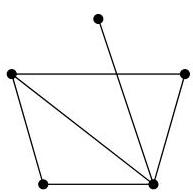
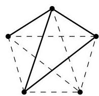

Chapitre IV. Coloriage

FIGURE IV.18. Un graphe et un coloriage de  $K_{n}$ .

En effet, par hypothèse de récurrence, les nombres  $R(s - 1,t)$  et  $R(s,t - 1)$  existent. De plus, prendre un graphe arbitraire  $G$  ayant  $n$  sommets revient exactement à considérer un sous-graphe monochromatique de  $K_{n}$  (grace à  $G$ , on sélectionne certaines arêtes qui recoivent toutes la même couleur, les autres arêtes de  $K_{n}$  non presents dans  $G$  receivevant la seconde couleur $^{9}$ .)

Soit  $v$  un sommet de  $G$ . Désignons par  $A_v = V \setminus (\nu(v) \cup \{v\})$ , l'ensemble des sommets distincts de  $v$  et qui ne sont pas voisins de  $v$ . Puisque  $G$  a

$$
\# V \setminus \{v \} = R (s - 1, t) + R (s, t - 1) - 1
$$

sommets distincts de  $v$ , alors

$$
\# \nu (v) \geq R (s - 1, t) \text { ou } \# A _ {v} \geq R (s, t - 1).
$$

En effet,  $\nu (v)$  et  $A_{v}$  partitionnent  $V\setminus \{v\}$  (donc  $\# \nu (v) + \# A_v = \# V\setminus \{v\})$

Supposons tout d'abord que  $\# \nu (v)\geq R(s - 1,t)$ . Par définition du nombre de Ramsey  $R(s - 1,t)$ , le sous-graphe de  $G$  induit par  $\nu (v)$  contient un sous-graphe  $B$  isomorphe à  $K_{s - 1}$  ou un ensemble de sommets indépendants de taille  $t$ . Dans le premier cas, le sous-graphe induit par  $B\cup \{v\}$  est isomorphe à  $K_{s}$  (en effet,  $v$  est adjacent à tous les sommets de  $B$ ). Dans le second cas, on dispose directement d'un sous-ensemble de sommets indépendants de taille  $t$ .

Supposons à présent que  $\# A_v \geq R(s, t - 1)$ . Par définition du nombre de Ramsey  $R(s, t - 1)$ , le sous-graphe de  $G$  induit par  $A_v$  contient un sous-graphe isomorphe à  $K_s$  (ce qui suffit) ou un ensemble  $C$  de sommets indépendants de taille  $t - 1$ . Dans ce dernier cas,  $C \cup \{v\}$  est un ensemble de sommets indépendants de taille  $t$  (en effet,  $v$  n'est adjacent à aucun sommet de  $C$ ).

L'inégalité est facile à vérifier. On procède une fois encore par récurrence sur  $s + t$ . Pour  $s = 2$  (ou  $t = 2$ ), on a bien

$$
\underbrace {R (2 , t)} _ {= t} \leq \underbrace {\mathrm {C} _ {t} ^ {1}} _ {= t}.
$$

Supposons que  $R(s,t) \leq \mathrm{C}_{s + t - 2}^{s - 1}$  pour tous  $s, t$  tels que  $s + t &lt; N$  et vérifièn-le pour  $s + t = N$ . Une fois encore, nous pouvons supposer  $s, t \geq 3$ . Par