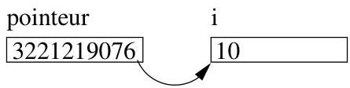

Chapitre V. Annexe : implémentation en C

```c
include<stdio.h>
main()
{
int i;
int *pointeur;
i=10;
pointeur=&amp;i
*pointeur=55;
printf("&gt; %d\n",*pointeur);
}
```

Ce programme affiche : 55.


FIGURE V.1. Un pointeur et une variable.

Exemple V.1.3. Puisqu'un pointeur est lui-même une variable (qui contient l'adresse d'une autre variable), on peut définir un pointeur vers un pointeur (i.e., une variable contenant l'adresse d'un pointeur).

```c
#include<stdio.h>
main()
{
int a=1;
int *p;
int **q;
printf("%d, ",a);
p=&amp;a
*p=2;
printf("%d, ",a);
q=&amp;p
**q=3;
printf("%d\n",a);
}
```

Affichage: 1, 2, 3.

L'utilisation des pointeurs présente deux intérêts majeurs : passer l'adresse d'une variable à une fonction et allouer dynamiquement de la mémoire.

Exemple V.1.4. Un exemple archi-classique consiste à définir une fonction inversant le contenu de deux variables. Voici d'abord un programme erroné.

```c
/* Exemple errone --- */
#include <stdio.h>
void swap(int x, int y);
main()
{
int a=1,b=2;</stdio.h></stdio.h></stdio.h>