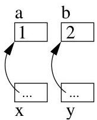

Chapitre V. Annexe : implémentation en C

&gt; a=1, b=2
&gt; a=2, b=1

En effet, la fonction swap a accès au contenu des variables a et b grâce à leur adresse. On a schématiquement la situation représentée à la figure V.2.


FIGURE V.2. L'échange de deux variables.

1.2. Allocation dynamique. Il se peut qu'en cours d'exécution d'un programme, il soit nécessaire d'affecter une valeur à une nouvelle variable. Si cette dernière n'a pas été déclarée avant la compilation, le programme ne peut réaliser cette affection. On peut pallier à cet inconvenient grâce à une instruction comme malloc. Cette fonction create un espace mémoire pour y stocker une donnée. Il faut donc lui préciser la taille de l'espace mémoire à réserver (En effet, chaque type de variable consomme une quantité plus ou moins grande de mémoire). De plus, malloc renvoie l'adresse de la zone mémoire qui vient d'être réservée. Cette dernière sera donc stockée par un pointeur. Si l'allocation mémoire n'est pas possible, malloc renvoie NULL.

Example V.1.5. Remarquer que, dans l'exemple qui suit, l'unique variable définie p est un pointeur vers un entier.

```c
include<stdio.h>
main()
{
int *p;
p=(int *) malloc(sizeof(int));
*p=3;
printf("adresse : %u contenu : %d \n",p,*p);
}
```

En fait, malloc renvoie un pointeur "générique". Ainsi, au lieu de taper simplement

p=malloc(sizeof(int));

on a effectué ce qu'on appelle un transtypage ("casting"), i.e., on transforme le pointeur "générique" en un pointeur vers un entier. Sans ce transtypage, le compilateur (ici gcc) produit en général un message d'alerte comme cédessous

test.c:5: warning: assignment makes pointer from integer without a cast</stdio.h>