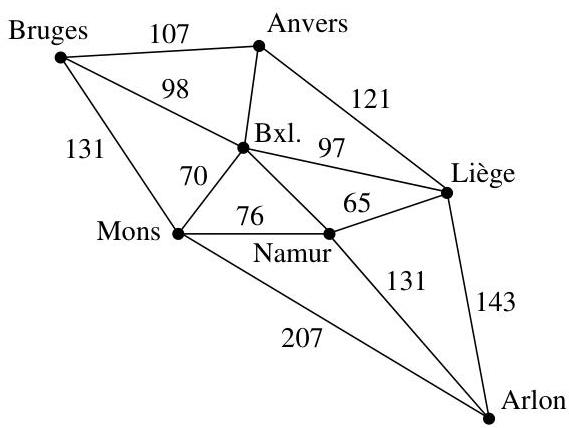
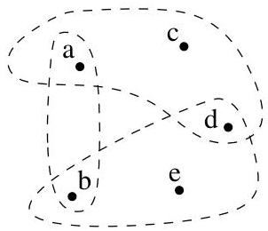

I.2. Graphes non orientés

FIGURE I.10. Graphé étiqueté par les distances entre villes (itinétaire "express" calculé par www.mappy.fr).

Pour terminer cette section, nous généralisons le concept de graphe en autorisant non plus des relations binaires entre sommets (autrement dit, des arcs) mais des relations d'arité quelconque (des hyper-arêtes). Ensuite, nous donnons une brève introduction aux matroides.

Définition I.2.9. Un hyper-graphe  $H = (V, E)$  est la donnée de deux ensembles  $V$  et  $E$ . L'ensemble  $V$ , comme dans le cas d'un graphe, est l'ensemble des sommets de  $H$ . Par contre,  $E$  est une partie de  $\mathcal{P}(V)$  (l'ensemble des parties de  $V$ ). Un élément de  $E$  est appelé hyper-arête. Soient  $V = \{a, b, c, d, e\}$  et

$$
E = \{\{a, b \}, \{a, c, d \}, \{b, d, e \} \}.
$$

On dispose de l'hyper-graphe  $H = (V, E)$  représenté à la figure I.11. Un

FIGURE I.11. Un exemple d'hyper-graphe.

hyper-graphe  $H = (V,E)$  est fini si  $V$  est fini.

La notion de matroïde est due à H. Whitney (1935) et a été développée par W. Tutte. Elle permet notamment l'étude axiomatique des propriétés de l'indépendance linéaire ou aussi l'étude des cycles et des arbres.

Définition I.2.10. Un matroïde  $(M, \mathcal{I})$  est la donnée d'un ensemble fini  $M$  et d'une partie  $\mathcal{I}$  de  $\mathcal{P}(M)$ , i.e., d'une collection de sous-ensembles de  $M$ , vérifiant les trois propriétés suivantes