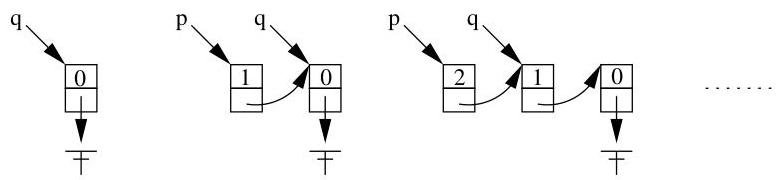

V.1. Pointeurs, allocation mémoire et listes chainées

```c
{ p=(ELT *) malloc(sizeof(ELT)); p-&gt;x=i; p-&gt;suivant=q; q=p; } /* parcours de la liste chainee - - - - - - - - - - - - - - - - - - - - - - - - - - - - - - - - - - - - - - - - - - - - - - - - - - - - - - - - - - - - - - - - - - - - - - - - - - - - - - - - - - - - - - - - - - - - - - - - - - - -  $\text{一}$  while (p-&gt;suivant !=NULL) { printf("  $\text{一} ^ { \text{一} }$  %d -- adresse %u \n",p-&gt;x,p); p=p-&gt;suivant; } printf("  $\text{一} ^ { \text{一} }$  %d -- adresse %u \n",p-&gt;x,p); /*libere la memoire - - - - - - - - - - - - - - - - - - - - - - - - - - - - - - - - - - - - - - - - - - - - - - - - - - - - - - - - - - - - - - - - - - - - - - - - - - - - - - - - - - - - - - - - - - - - - - - - - - - -  $\text{一}$  Schématiquement, la création de la liste chainée se passse comme indiqué à la figure V.3. 
FIGURE V.3. Création d'une liste chainee.

Le programme affiche un résultat semblable à :

&gt;5--adresse134520920
&gt;4--adresse134520904
&gt;3--adresse134520888
&gt;2--adresse134520872
&gt;1--adresse134520856
&gt;0--adresse134520840

Pour connaître le nombre d'octets nécessaires pour stocker un type de données sur une architecture donnée, on peut utiliser une instruction comme